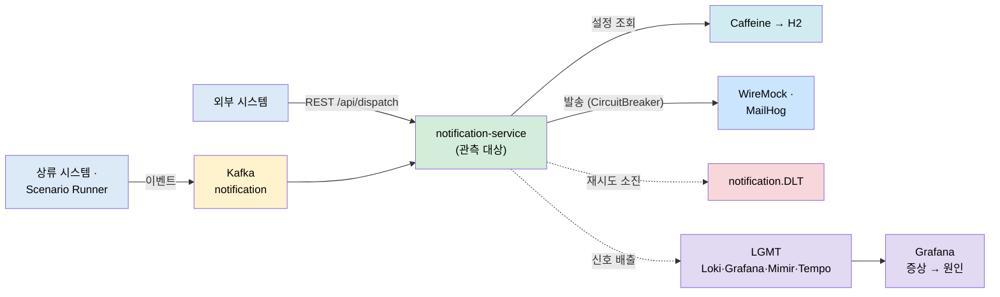

# notification-lab — 전체 개요

이 문서는 프로젝트의 **목적 · 전체 아키텍처 · 기능별 학습 여정**을 한눈에 보여주는 진입점입니다. 단계별 진행은 [ROADMAP](ROADMAP.md)이, 실행 방법은 [README](README.md)가, 각 기능의 깊은 기록은 아래에서 링크하는 문서가 담습니다.

## 1. 왜 이 프로젝트인가

`notification-lab`은 **Kafka 알림 파이프라인을 관측 대상으로 삼는 실험실**입니다. 알림 발송 기능을 새로 많이 만드는 게 목표가 아니라, 그 파이프라인에서 지연·실패·재시도·DLT·캐시·DB 병목을 의도적으로 일으키고 **metric → log → trace 순서로 원인을 좁히는 법**을 학습합니다. 그래서 이 저장소의 핵심 결과물은 알림 기능이 아니라 실험 기록과 Runbook입니다.

두 축으로 나뉩니다.

- **기능 축 (무엇을)**: 알림을 어떻게 소비·발송·설정·조회·아카이빙하는가 — UC-1~5. 이게 관측 *대상*입니다.
- **관측 축 (어떻게)**: 그 대상에서 문제를 어떤 증거로 진단하는가 — 3단계 LGMT 스터디.

## 2. 통합 아키텍처

발송 파이프라인(관측 대상)과 관측 스택(LGMT)을 한 장에 둡니다. 서비스 내부 상세는 [서비스 아키텍처](apps/notification-service/docs/03-architecture.md), 관측 구성 상세는 [관측 아키텍처](observability/docs/01-architecture.md)에 있습니다.

## 3. 기능별 학습 여정

각 UC마다 "무엇을·왜 배웠나 → 핵심 깨달음 → 상태 → 다음"을 추적합니다. 번호는 명세 ID이고 **진행 순서의 SSOT는 [ROADMAP](ROADMAP.md)** 입니다 (실제 진행: UC-1 → UC-4 → UC-2). 깊은 기록은 리뷰 노트([uc/](apps/notification-service/docs/uc/00-index.md))와 이해 기록([learning/](apps/notification-service/docs/learning/00-index.md))에 있습니다.

| UC | 무엇을 / 왜 | 핵심 깨달음 | 상태 | 다음 |
|----|-----------|------------|------|------|
| [UC-1](apps/notification-service/docs/learning/UC-1-kafka-notification.md) | Kafka 소비 → 채널별 발송 → 재시도·DLT | 재시도 단위는 리스너 메서드 전체 → 부분 실패 시 중복 발송. CircuitBreaker는 프록시 경유라 별도 빈 필요 | ✅ 마무리 (2026-07-20) | Testcontainers E2E 자동화 |
| [UC-4](apps/notification-service/docs/learning/UC-4-channel-setting.md) | 채널 설정 REST CRUD + 캐시 갱신 | `@CacheEvict`가 아니라 `@CachePut` — 저장 시점에 정확한 값을 알므로 지우지 않고 써넣어 즉시 반영 | ✅ 마무리 (2026-07-21) | 400·키 불일치 실측 + ArchUnit |
| [UC-2](apps/notification-service/docs/learning/UC-2-rest-dispatch.md) | 외부 REST 발송 (dispatch 컨텍스트) | UC-1 발송 경로 재사용 + 앞단에 수신자 조회. 동기 집계로 응답 코드(200/207/404/502) 결정 | ✅ 마무리 (2026-07-22) | send 헥사고날 전환 반영 |
| [UC-3](apps/notification-service/docs/learning/UC-3-history-query.md) | 알림 이력 조회 (OpenSearch) | (구현 후 채움) — 채널별 쿼리 매퍼로 분기 캡슐화 예정 | ⬜ 미착수 | UC-5 색인 후 구현 |
| [UC-5](apps/notification-service/docs/learning/UC-5-log-archiving.md) | 로그 아카이빙 (@Scheduled) | (구현 후 채움) — 시간이 액터, 중복 실행 방지가 관건 | ⬜ 미착수 | history 패키지 구현 |

관측 축(3단계)의 실험 단위(UC-01~12)는 별도 축입니다 — 상세는 [관측 시나리오와 운영 절차](observability/docs/02-scenarios-and-operations.md).

## 4. 문서 지도

이 저장소의 문서는 역할별 4계층입니다. 처음 방문자는 이 순서로 읽으면 됩니다.

| 계층 | 위치 | 역할 |
|------|------|------|
| 설계 | [docs/](apps/notification-service/docs/) (01 요구·02 액터·03 아키) | 무엇을 왜 만드는가 |
| 리뷰 렌즈 | [docs/uc/](apps/notification-service/docs/uc/00-index.md) | 구현을 손으로 리뷰·관찰하는 절차 |
| 이해 기록 | [docs/learning/](apps/notification-service/docs/learning/00-index.md) | 구현 후 흐름을 자기 언어로 설명한 5단계 기록 |
| 개념 | [docs/concepts/](apps/notification-service/docs/concepts/00-index.md) | UC에 매이지 않는 "왜 그렇게 동작하는가" |

진행 상태는 [PROGRESS](apps/notification-service/PROGRESS.md), 단계 SSOT는 [ROADMAP](ROADMAP.md), 코드 컨벤션은 [AGENTS.md](AGENTS.md)에 있습니다.
