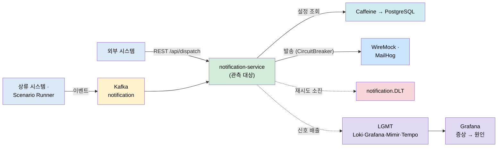

# notification-lab — Kafka Notification Observability Lab

> Kafka 알림 파이프라인에서 지연·실패·재시도·DLT·캐시·DB 병목을 **의도적으로 만들고**, LGMT(Loki·Grafana·Mimir·Tempo)로 원인을 추적하는 관측 실험실입니다. 알림 서비스는 관측 *대상*이고, 실험 기록과 Runbook이 이 저장소의 핵심 결과물입니다.

## 왜 이 프로젝트인가

알림 발송 기능을 많이 만드는 게 목표가 아닙니다. 그 파이프라인에서 문제를 일으키고 **metric → log → trace 순서로 원인을 좁히는 법**을 학습하는 게 목표입니다. 그래서 두 축으로 나뉩니다.

- **기능 축 (무엇을)**: 알림을 어떻게 소비·발송·설정·조회·아카이빙하는가 — UC-1~5. 이게 관측 대상입니다.
- **관측 축 (어떻게)**: 그 대상에서 문제를 어떤 증거로 진단하는가 — 3단계 LGMT 스터디.


## 통합 아키텍처

발송 파이프라인(관측 대상)과 관측 스택(LGMT)을 한 장에 둡니다. 서비스 내부 상세는 [서비스 아키텍처](apps/notification-service/docs/03-architecture.md), 관측 구성 상세는 [관측 아키텍처](observability/docs/01-architecture.md)에 있습니다.




## 목표 — 두 흐름, 만들고 나서 관측한다

이 랩은 **① 알림 서비스를 만들고 → ② 그 서비스를 관측 대상으로 삼아 장애를 추적**하는 두 흐름으로 나아갑니다. 이 큰 두 축이 "무엇을(기능)"과 "어떻게(관측)" 두 축과 그대로 대응합니다. 지금은 ① 구현을 거의 마치고 ② 관측 스터디 진입을 앞둔 지점입니다.

세부 단계(로드맵 1·2·3단계와 그 하위 작업 2-1~2-4·3-1~3-4)의 SSOT는 [ROADMAP](ROADMAP.md)입니다. 아래는 그 진행을 두 흐름으로 묶어 보여주는 요약입니다.

```mermaid
flowchart LR
    subgraph BUILD["① 알림 서비스 구현 (로드맵 1·2단계)"]
        direction LR
        B1["UC-1 발송 ✅"] --> B2["UC-4 설정 ✅"] --> B3["UC-2 REST ✅"] --> B4["UC-3·5 이력 ✅"] --> B5["E2E 자동화 🔜"]
    end
    subgraph OBS["② LGMT 관측 스터디 (로드맵 3단계)"]
        direction LR
        O1["3-1 기준선"] --> O2["3-2 계측"] --> O3["3-3 장애 실험"] --> O4["3-4 Runbook"]
    end
    BUILD ==>|"구현된 파이프라인을<br>관측 대상으로"| OBS
    style B1 fill:#d4edda,color:#000
    style B2 fill:#d4edda,color:#000
    style B3 fill:#d4edda,color:#000
    style B4 fill:#d4edda,color:#000
    style B5 fill:#fff3cd,color:#000
    style O1 fill:#e2d9f3,color:#000
    style O2 fill:#e2d9f3,color:#000
    style O3 fill:#e2d9f3,color:#000
    style O4 fill:#e2d9f3,color:#000
```



| 흐름 | 하는 일 | 상태 |
|------|---------|------|
| **① 알림 서비스 구현** | UC-1~5로 소비·발송·설정·이력을 만들고, Testcontainers로 E2E를 자동화한다 | 🔜 UC-1~5 완료, E2E 자동화 남음 |
| **② LGMT 관측 스터디** | 그 서비스에 장애를 주입하고 metric·log·trace로 원인을 좁힌다 — dashboard·alert·Runbook | 🔜 다음 국면 (약 1개월) |

① 흐름에서 각 UC로 무엇을 배웠는지는 바로 아래 [기능별 학습 여정](#과정--기능별-학습-여정)이, ② 흐름의 주차별 세부는 [ROADMAP 3단계](ROADMAP.md)가 이어갑니다.


## 과정 — 기능별 학습 여정

각 UC에서 무엇을 배웠고 핵심 깨달음이 무엇인지 추적합니다. 번호는 명세 ID이며 실제 진행 순서(UC-1 → UC-4 → UC-2 → UC-3/5)의 SSOT는 [ROADMAP](ROADMAP.md)입니다. 깊은 기록은 [이해 노트](apps/notification-service/docs/learning/00-index.md)와 [리뷰 노트](apps/notification-service/docs/uc/00-index.md)에 있습니다.

| UC | 무엇을 | 핵심 깨달음 | 상태 |
|----|--------|------------|------|
| [UC-1](apps/notification-service/docs/learning/UC-1-kafka-notification.md) | Kafka 소비 → 채널별 발송 → 재시도·DLT | 재시도 단위는 리스너 메서드 전체라 부분 실패 시 중복 발송. CircuitBreaker는 프록시 경유라 별도 빈이 필요 | ✅ 완료 |
| [UC-4](apps/notification-service/docs/learning/UC-4-channel-setting.md) | 채널 설정 REST CRUD + 캐시 갱신 | `@CacheEvict`가 아니라 `@CachePut` — 저장 시점에 정확한 값을 알므로 지우지 않고 써넣어 즉시 반영 | ✅ 완료 |
| [UC-2](apps/notification-service/docs/learning/UC-2-rest-dispatch.md) | 외부 REST 발송 (dispatch 컨텍스트) | UC-1 발송 경로 재사용 + 앞단에 수신자 조회. 동기 집계로 응답 코드(200/207/404/502)를 결정 | ✅ 완료 |
| [UC-3](apps/notification-service/docs/learning/UC-3-history-query.md) | 알림 이력 조회 (PostgreSQL·ULID) | 저장을 RDB로 선 구현 — 채널별 쿼리 매퍼는 검색엔진 사정이라 RDB 파라미터 쿼리로 대체 | ✅ 완료 (2026-07-22) |
| [UC-5](apps/notification-service/docs/learning/UC-5-log-archiving.md) | 로그 아카이빙 (@Scheduled·NDJSON) | 색인은 발송 직후 best-effort 기록, export는 cron + 수동 재실행 이중 경로 | ✅ 완료 (2026-07-22) |

관측 축(3단계)의 실험 단위(UC-01~12)는 별도 축입니다 — 상세는 [관측 시나리오와 운영 절차](observability/docs/02-scenarios-and-operations.md).


## 실행

```bash
cd ~/notification-lab
docker compose -f infra/compose.yaml up -d      # Kafka·PostgreSQL·WireMock 등
cd apps/notification-service
./gradlew bootRun                               # Undertow로 8092에 기동
```


## 문서 지도

처음 방문자는 이 순서로 읽으면 됩니다. 설계·리뷰·이해·개념의 4계층입니다.

| 계층 | 위치 | 역할 |
|------|------|------|
| 설계 | [docs/](apps/notification-service/docs/) (요구·액터·아키텍처) | 무엇을 왜 만드는가 |
| 리뷰 렌즈 | [docs/uc/](apps/notification-service/docs/uc/00-index.md) | 구현을 손으로 리뷰·관찰하는 절차 |
| 이해 기록 | [docs/learning/](apps/notification-service/docs/learning/00-index.md) | 구현 후 흐름을 자기 언어로 설명한 기록 |
| 개념 | [docs/concepts/](apps/notification-service/docs/concepts/00-index.md) | UC에 매이지 않는 "왜 그렇게 동작하는가" |

진행 상태는 [PROGRESS](apps/notification-service/PROGRESS.md), 단계 SSOT는 [ROADMAP](ROADMAP.md), 코드 컨벤션은 [AGENTS.md](AGENTS.md)에 있습니다. 발생기 책임 경계는 [scenario-runner 문서](apps/notification-scenario-runner/README.md)에서 확인합니다.

## 프로젝트 구성

```text
notification-lab/
  README.md                         # 이 문서 — 목적·아키텍처·단계·여정 진입점
  ROADMAP.md                        # 단계와 3단계 관측 스터디 SSOT
  apps/                             # 코드
    notification-service/           # Kafka 소비·채널 설정·외부 발송·이력 (관측 대상)
    notification-scenario-runner/   # 🟡 3단계 부하·장애 발생기 스캐폴딩
  infra/                            # Kafka·PostgreSQL·WireMock·LGMT compose와 설정
  observability/                    # 3단계 관측 스터디 (설계 + 결과물 한 지붕)
    docs/                           # 관측 설계 문서 (계획·아키텍처·시나리오)
    dashboards/ alerts/ scenarios/  # Grafana JSON · alert rule · 시나리오 정의
    experiments/ runbooks/          # 증거·원인 판단 · 장애 조사 절차
```
