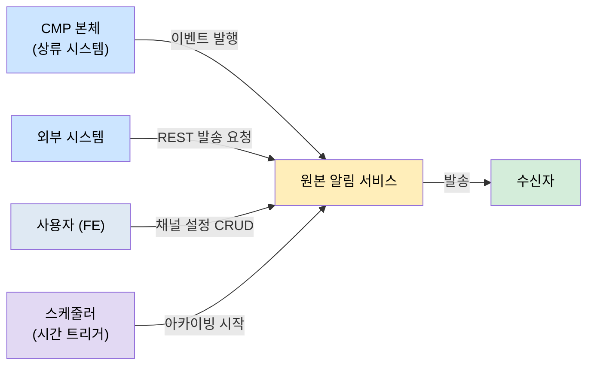
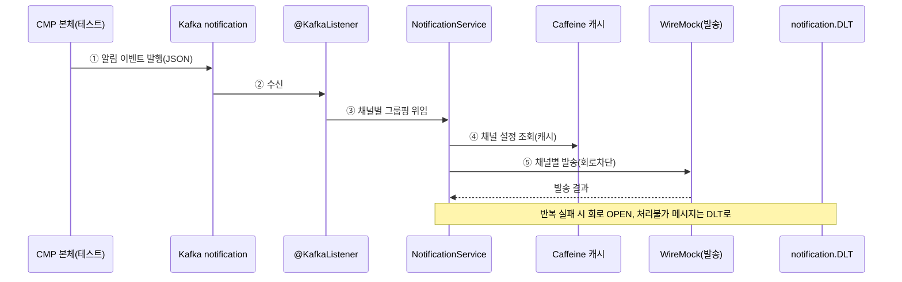

# 축 A 원본 알림 서비스 — 액터 및 유스케이스

이 문서는 원본 알림 서비스를 **누가(액터) 어떻게(유스케이스) 쓰는가**를 정의합니다. [01-requirements.md](01-requirements.md)의 기능 요구사항을 사용자 관점으로 다시 본 것입니다.

- 원본 근거: `원본 커스텀/01-backend.md` §5(유스케이스 흐름)·§6(BE↔FE 연동)

---

## 1. 액터 정의

원본 서비스는 사람 사용자보다 **시스템 액터**가 중심입니다. 알림이 사람의 클릭이 아니라 다른 시스템의 이벤트로 시작하기 때문입니다.

| 액터 | 유형 | 역할 | 근거 |
|------|------|------|------|
| **CMP 본체** | 상류 시스템 | Kafka `notification` 토픽에 알림 이벤트를 발행한다. 이 서비스의 주 트리거 | §5.1 |
| **수신자** | 외부 대상 | 알림을 실제로 받는 사람. 서비스를 직접 조작하지 않고 발송 대상이 됨 | §5.1 |
| **사용자 (FE)** | 사람 | 개인 알림채널(SMS/Email/알림톡 수신 여부)을 조회·저장. 인증 blacklist라 토큰 없이 접근 | §6 |
| **외부 시스템** | 상류 시스템 | REST API로 직접 알림 발송을 요청(외부 솔루션) | §5.2 |
| **스케줄러** | 시간 트리거 | 정해진 시각에 로그 아카이빙을 시작. 사람이 아닌 시간이 액터 | §1 (매일 00:05) |

> **미니 프로젝트에서의 대체**: CMP 본체·외부 시스템·수신자는 실제 시스템이 없으므로 **테스트 코드가 그 역할**을 합니다. 테스트가 Kafka에 이벤트를 발행(CMP 본체 대역)하고, WireMock/MailHog이 발송 대상(수신자 대역)이 됩니다.

---

## 2. 유스케이스 목록

| ID | 유스케이스 | 주 액터 | 원본 | 우선순위 |
|----|-----------|---------|------|----------|
| **UC-1** | Kafka 알림 발송 | CMP 본체 | §5.1 | ★ 핵심 (a1) |
| **UC-2** | 외부 솔루션 REST 발송 | 외부 시스템 | §5.2 | a1 후속 |
| **UC-3** | 알림 이력 조회 | 사용자 | §5.3 | a2 |
| **UC-4** | 알림채널 설정 | 사용자(FE) | §6 | a1 (REST 최소) |
| **UC-5** | 로그 아카이빙 | 스케줄러 | §1 | a2 |

---

## 3. 유스케이스 명세

### UC-1. Kafka 알림 발송 (핵심)

이 서비스의 존재 이유입니다. 알림 이벤트가 도착하면 채널별로 분기해 발송합니다.

- **주 액터**: CMP 본체 (Kafka 발행)
- **사전조건**: Kafka `notification` 토픽 존재, 발송 목(WireMock) 기동
- **주 흐름**:
  1. CMP 본체가 `notification` 토픽에 알림 이벤트(JSON)를 발행한다
  2. `@KafkaListener`가 이벤트를 수신한다 (원본: 사내 Kafka 라이브러리 `@TopicHandler`)
  3. 수신자를 SMS / ALIMTALK / EMAIL 채널별로 그룹핑한다
  4. 채널 설정을 조회한다 (캐시 히트 시 외부 조회 생략 — Caffeine)
  5. 채널별로 외부 발송 API를 호출한다 (Resilience4j 회로차단기로 감쌈)
  6. 발송 결과를 로그로 남긴다
- **대안 흐름**:
  - 5a. 발송이 반복 실패 → 회로 OPEN, 이후 호출 즉시 차단
  - 2a/5b. 처리 불가 메시지 → 재시도 후 `notification.DLT`로 적재 (유실 방지)
- **오픈소스 대체**: 사내 Kafka 라이브러리→`@KafkaListener`+`DeadLetterPublishingRecoverer`, NCP→WireMock

### UC-2. 외부 솔루션 REST 발송

외부 시스템이 REST로 직접 발송을 요청합니다. CMP 조직 API에서 수신자를 조회한 뒤 채널별로 집계합니다.

- **주 액터**: 외부 시스템
- **사전조건**: 조직 API 목(WireMock) 기동
- **주 흐름**:
  1. 외부 시스템이 `POST {prefix}/v1/notification/externalSolutions` 호출
  2. 기본·비즈니스 검증
  3. 채널별 이벤트로 변환
  4. OpenFeign으로 조직 API에서 수신자 그룹 조회
  5. 채널별 발송
  6. 전체 결과 집계 → 응답 코드 결정
- **오픈소스 대체**: CMP 조직 API·발송 모두 WireMock 목

### UC-3. 알림 이력 조회

NCP 발송 이력을 중계 조회합니다. 채널마다 쿼리 형식이 달라 채널별 매퍼를 선택합니다.

- **주 액터**: 사용자
- **주 흐름**:
  1. `GET {prefix}/v1/notification/history?channel=SMS` 호출
  2. 채널별 쿼리 매퍼 선택 (`QueryParamMapperFactory`)
  3. 이력 조회 (미니: OpenSearch에서 조회)
  4. 이력 목록 응답
- **오픈소스 대체**: NCP 이력 API → OpenSearch 색인 조회(a2에서 색인한 이력)

### UC-4. 알림채널 설정

사용자가 개인 알림 수신 채널을 켜고 끕니다. 원본에서 프론트가 실제 호출하던 유일한 화면 기능입니다.

- **주 액터**: 사용자 (FE)
- **주 흐름**:
  1. `GET {prefix}/v1/notificationChannel/user?userId=...` 개인 채널 조회
  2. 사용자가 SMS/Email/알림톡 수신 여부 변경
  3. `PUT {prefix}/v1/notificationChannel/user/update` 저장
- **특이사항**: 인증 blacklist 경로라 토큰 없이 접근 (§6)
- **미니 방침**: 프론트 최소화 — REST 계약(요청/응답)만 두고, 화면은 만들지 않음. UC-1의 채널 설정 조회(FR-3)가 이 데이터를 읽음

### UC-5. 로그 아카이빙

스케줄러가 주기적으로 이력을 파일로 내보냅니다.

- **주 액터**: 스케줄러 (시간 트리거)
- **주 흐름**:
  1. 정해진 시각에 배치 시작 (원본: 매일 00:05)
  2. 전일 이력 인덱스 조회 (OpenSearch)
  3. `.log`/파일로 export
- **오픈소스 대체**: 동일 구조, OpenSearch single-node 대상

---

## 4. 유스케이스 ↔ 요구사항 추적

| 유스케이스 | 관련 FR |
|-----------|---------|
| UC-1 | FR-1·2·3·4·5·6(로깅) |
| UC-2 | FR-6 |
| UC-3 | FR-10 |
| UC-4 | FR-12 |
| UC-5 | FR-8·11 |

> 이 추적표로 "어떤 요구사항이 어느 유스케이스에서 실현되는가"를 확인합니다. 코드 구현 시 각 프로젝트의 `SCOPE.md`가 담당 UC/FR을 명시합니다.
