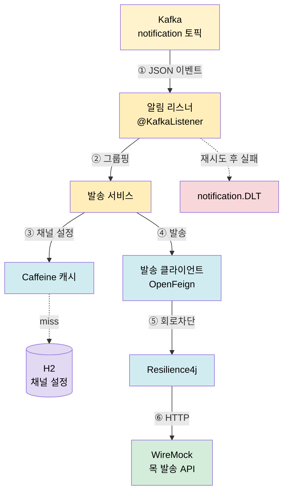
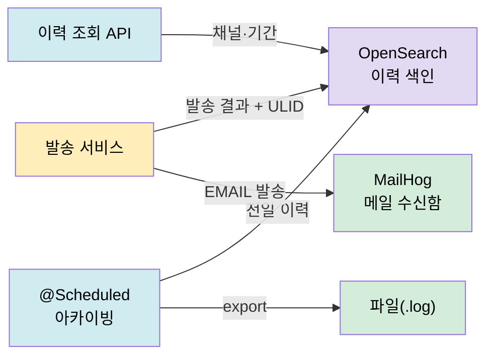
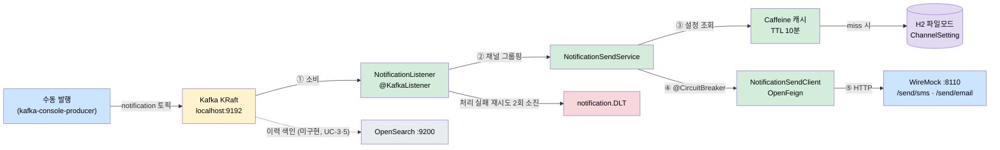
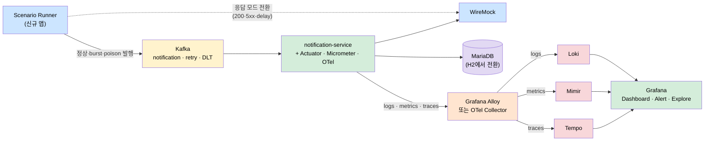

# 축 A 원본 알림 서비스 — 아키텍처

이 문서는 원본 알림 서비스를 오픈소스로 재현할 때의 **구조**를 정의합니다. [01-requirements.md](01-requirements.md)의 요구와 [02-actors-usecases.md](02-actors-usecases.md)의 유스케이스를 어떤 계층·컴포넌트·인프라로 실현하는지 봅니다.

- 원본 근거: `원본 커스텀/01-backend.md` §3(아키텍처)

---

## 1. 계층 구조

원본은 전통적인 4계층입니다. 미니 프로젝트도 이 계층을 그대로 따릅니다.

```
Controller → Service (interface + impl) → Domain (model/entity/mapper)
                                        → Repository (JPA)
                                        → Remote (OpenFeign / HTTP)
```

원본 진입점 클래스에는 `@EnableFeignClients`·`@EnableJpaAuditing`·`@EnableScheduling`이 선언돼 Feign·JPA Auditing·스케줄러가 기동 시 켜집니다. 미니 프로젝트도 발송(Feign)·이력(JPA/OpenSearch)·아카이빙(스케줄러)에 이 조합을 씁니다. 단 원본의 Jasypt 암호화(`@EnableEncryptableProperties`)는 축 B(b3-web-server-lab)에서 다루므로 여기선 생략합니다.

---

## 2. 컴포넌트 구성

발송 파이프라인(a1)을 중심으로 본 컴포넌트입니다. 원본 실제 클래스명을 괄호로 병기합니다.

| 컴포넌트 | 역할 | 원본 대응 | 개념 |
|----------|------|-------------|------|
| **알림 리스너** | Kafka 토픽 소비, 파싱 | `NotificationTopicHandler` (사내 Kafka 라이브러리 `@TopicHandler`) | `@KafkaListener` |
| **발송 서비스** | 채널별 그룹핑·발송 조율 | `NotificationServiceImpl` | — |
| **채널 설정 캐시** | 수신자별 채널 설정 조회 캐시 | (채널 관리 + Caffeine) | Caffeine |
| **발송 클라이언트** | 외부 발송 API 호출 | `NcpUtil`(실제)/`NotificationApiClient`(Feign, deprecated) | OpenFeign |
| **회로차단기** | 반복 실패 시 발송 차단 | (원본 미적용) | Resilience4j |
| **에러 핸들러 / DLT** | 처리불가 메시지 격리 | 사내 Kafka 라이브러리 `FailurePolicy.DLQ` | `DeadLetterPublishingRecoverer` |
| **이력 저장소** | 발송 이력 색인·조회 | OpenSearch client | OpenSearch (a2) |
| **아카이빙 스케줄러** | 전일 이력 파일 export | OpenSearch 배치 | `@Scheduled` (a2) |

---

## 3. 발송 파이프라인 아키텍처 (a1)



---

## 4. 이력·아카이빙 아키텍처 (a2)



---

## 5. 인프라 (Docker Compose)

로컬 단일 스택으로 기동합니다. 포트는 원본 실제(8091)·플레이그라운드(8070)와 겹치지 않게 잡습니다.

| 서비스 | 용도 | 대체 대상 | 참고 포트 |
|--------|------|-----------|-----------|
| Kafka (KRaft) | 알림 이벤트 버스 | (동일) | 9092 |
| kafka-ui | 토픽·메시지 확인 | 원본 kafka-ui | 8100 |
| Redis | (Resilience4j·캐시 실험 여지) | — | 6379 |
| OpenSearch (single-node) | 이력 색인·조회 | 원본 OpenSearch | 9200 |
| MailHog | 메일 수신 확인 | NCP SENS 메일 | SMTP 1025 / UI 8025 |
| WireMock | SMS·알림톡·조직 API 목 | NCP SENS·CMP 조직 API | 8110 |

> 앱 자체 포트는 8091 대신 **8092**(a1)·**8093**(a2)로 잡아 원본 실물과 구분합니다(코드 착수 시 확정).

---

## 6. 원본 실제 → 오픈소스 대체 아키텍처 대조

핵심은 "구조는 같게, 외부 의존만 오픈소스로 바꾼다"입니다. 그래야 원본 코드를 열었을 때 같은 골격이 보입니다.

| 구조 요소 | 원본 실제 | 미니 프로젝트 | 바뀌는 것 |
|-----------|-------------|---------------|-----------|
| 이벤트 소비 | 사내 Kafka 라이브러리 `@TopicHandler` | Spring `@KafkaListener` | 사내 어노테이션 → 표준 |
| 직렬화 | Avro + 사내 Schema Registry (실제 String) | String/JSON | 스키마 레지스트리 제거 |
| 실패 정책 | 사내 Kafka 라이브러리 `FailurePolicy` | `DefaultErrorHandler` + DLT | 사내 정책 → 표준 에러 핸들러 |
| 발송 | `NcpUtil` HTTPS + HMAC 서명 | OpenFeign → WireMock | 서명 제거, 목으로 |
| 회로차단 | 없음 | Resilience4j | **학습용 추가** |
| 이력 저장 | OpenSearch (사내) | OpenSearch (Docker) | 인프라만 로컬로 |
| DB | MariaDB / H2 | H2 | 동일(로컬 H2) |
| 웹서버 | Undertow | Undertow | 동일 |
| SSL | `SslConfig` 전역 우회 | 동일 재현 + 위험 주석 | 안티패턴 명시 |

> 회로차단(Resilience4j)은 원본엔 없지만, "외부 발송이라는 불안정한 호출을 어떻게 보호하는가"가 이 서비스의 핵심 학습 포인트라 의도적으로 더합니다. 나머지는 원본 구조를 최대한 보존합니다.

---

## 7. 코드 구조 (단일 프로젝트, 패키지 분할)

원본은 실제 하나의 서비스이므로 코드도 `a-notification` **단일 Spring Boot 프로젝트**로 두고, 두 흐름을 패키지로 나눕니다. (초기엔 a1/a2 두 프로젝트로 나눴다가, 원본 실제 구조·설계 통합에 맞춰 하나로 합쳤습니다.)

- **`notification.send`**: 계층 전체 골격 + 발송 파이프라인(UC-1) + 채널 설정(UC-4 REST) + 외부솔루션 발송(UC-2). 하위: `domain`·`channel`·`remote`·`service`·`listener`·`config`
- **`notification.history`** (후속): 이력 색인·조회(UC-3) + 아카이빙(UC-5) + 메일 실수신(FR-7) + SSL 재현

> 발송(`send`)을 먼저 완성하고, 이력(`history`)은 같은 프로젝트에 패키지로 추가합니다.

---

## 8. 현재 구현 아키텍처 (as-is, Phase 1 완료 시점)

위 1~7절은 설계 시점의 청사진이고, 이 절은 **2026-07-09 기준 실제로 돌아가는 것만** 그립니다. 점선은 설계에는 있으나 아직 코드가 없는 컴포넌트입니다. Kafka 포트는 §5 표의 9092가 아니라 **9192**입니다 — 다른 학습 프로젝트(redpanda-local)가 9092를 점유해 회피했습니다([PROGRESS.md](../PROGRESS.md) 참고).



- 앱은 Undertow로 **8092**에서 기동합니다(Tomcat 제외). 초록 = 구현·검증 완료(`send` 패키지), 회색 점선 = 미구현(`history` 패키지 예정).
- 검증 근거: 수동 E2E에서 수신자 2명(SMS·EMAIL) 이벤트가 WireMock 양 채널에 각 1건 도달. DLT는 적재 경로만 구현, 실측 전.
- UC별 구현 범위·검증 상태는 [uc/00-index.md](uc/00-index.md) 현황판에 있습니다.

---

## 9. 목표 아키텍처 (to-be, Phase 3 — LGMT Observability)

프로젝트 구현이 끝나면 이 서비스를 **관측 대상**으로 LGMT(Loki·Grafana·Mimir·Tempo) 스터디를 진행합니다([../../ROADMAP.md](../../ROADMAP.md) Phase 3). 이 그림은 그 설계의 출발점이며, 세부(Alloy vs OTel Collector, Prometheus vs Mimir 등)는 스터디 1주차에 확정합니다.



as-is에서 to-be로 가는 간극(관측 스택·Scenario Runner·MariaDB 전환·`notification.retry` 토픽)과 주차별 계획은 [../../ROADMAP.md](../../ROADMAP.md) Phase 3 절이 SSOT입니다. 핵심 관점은 하나입니다 — **모니터링은 문제가 있음을 알려주는 일이고, 옵저버빌리티는 왜 문제가 생겼는지 증거로 좁혀가는 일이다.**
