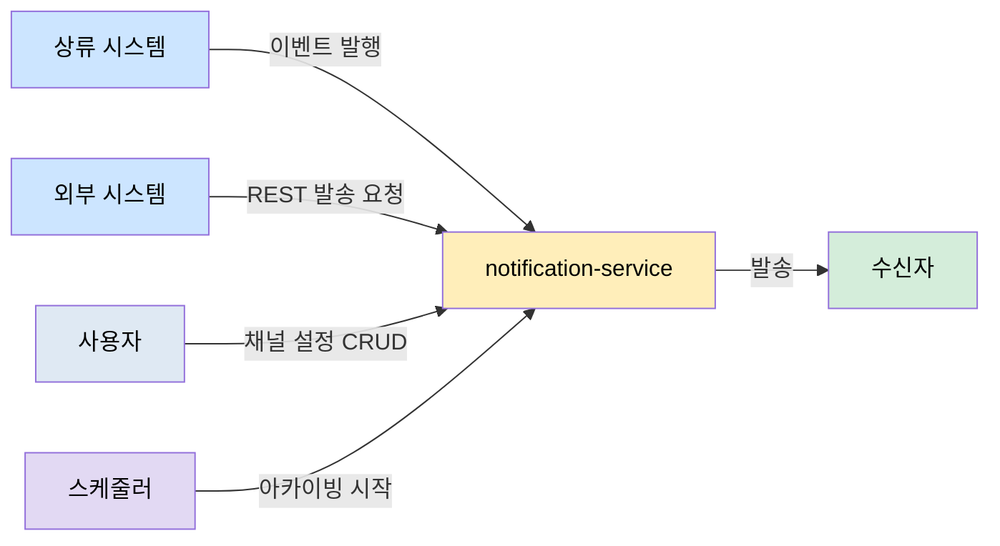

# notification-service — 액터 및 유스케이스

이 문서는 알림 서비스를 누가 어떤 흐름으로 사용하는지 정의합니다. 기능 요구사항은 [01-requirements.md](01-requirements.md), 구현 구조는 [03-architecture.md](03-architecture.md)를 참고합니다.

## 액터 정의

알림은 사람의 클릭보다 다른 시스템의 이벤트로 시작하므로 시스템 액터가 중심입니다.

| 액터 | 유형 | 역할 |
|------|------|------|
| 상류 시스템 | 시스템 | Kafka `notification` 토픽에 알림 이벤트를 발행한다 |
| 수신자 | 외부 대상 | 알림을 실제로 받는 사람이다 |
| 사용자 | 사람 | 개인 알림채널 수신 여부를 조회·저장한다 |
| 외부 시스템 | 시스템 | REST API로 직접 발송을 요청한다 |
| 스케줄러 | 시간 트리거 | 정해진 시각에 이력 아카이빙을 시작한다 |

테스트와 Scenario Runner는 상류 시스템을, WireMock과 MailHog은 외부 발송 대상을 대신합니다.

## 유스케이스 목록

| ID | 유스케이스 | 주 액터 | 상태 |
|----|-----------|---------|------|
| UC-1 | Kafka 알림 발송 | 상류 시스템 | 구현·검증 완료 |
| UC-2 | 외부 REST 발송 | 외부 시스템 | 후속 |
| UC-3 | 알림 이력 조회 | 사용자 | 후속 |
| UC-4 | 알림채널 설정 | 사용자 | 후속 |
| UC-5 | 로그 아카이빙 | 스케줄러 | 후속 |

## 유스케이스 명세

### UC-1. Kafka 알림 발송

상류 시스템이 알림 이벤트를 발행하면 서비스는 채널별로 분기해 발송합니다.

1. 상류 시스템이 `notification` 토픽에 JSON 이벤트를 발행합니다.
2. `@KafkaListener`가 이벤트를 수신하고 역직렬화합니다.
3. 서비스가 수신자를 채널별로 그룹핑하고 채널 설정을 조회합니다.
4. OpenFeign이 외부 발송 API를 호출합니다.
5. 반복 실패는 CircuitBreaker와 재시도를 거쳐 DLT로 격리합니다.

### UC-2. 외부 REST 발송

외부 시스템이 REST API로 발송을 요청하면 서비스는 수신자 조회 API에서 대상을 확인하고 채널별로 발송·집계합니다.

### UC-3. 알림 이력 조회

사용자가 채널과 기간으로 발송 이력을 조회합니다. 채널별 쿼리 조건을 만들고 OpenSearch에서 결과를 반환합니다.

### UC-4. 알림채널 설정

사용자가 SMS·EMAIL·알림톡 수신 여부를 조회하거나 변경합니다. UC-1은 이 설정을 캐시를 거쳐 읽습니다.

### UC-5. 로그 아카이빙

스케줄러가 전일 이력을 OpenSearch에서 읽어 파일로 내보냅니다.

## 요구사항 추적

| 유스케이스 | 관련 FR |
|-----------|---------|
| UC-1 | FR-1·2·3·4·5 |
| UC-2 | FR-6 |
| UC-3 | FR-10 |
| UC-4 | FR-12 |
| UC-5 | FR-8·11 |
