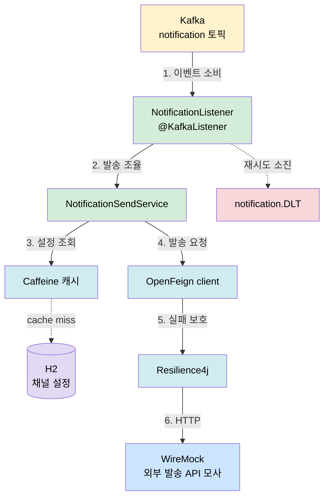
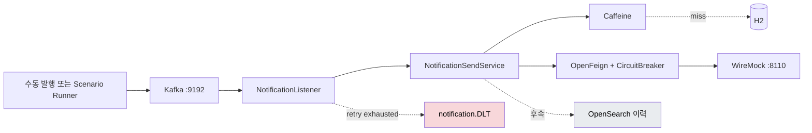

# notification-service — 아키텍처

`notification-service`는 Kafka 알림 이벤트를 소비해 수신자별 채널 설정을 조회하고 외부 발송 API에 전달하는 Spring Boot 서비스입니다. 이 문서는 현재 구현과 관측 스터디를 위한 확장 방향을 함께 설명합니다.

관련 문서: [요구사항](01-requirements.md), [유스케이스](02-actors-usecases.md), [관측 아키텍처](../../../docs/observability/01-architecture.md)

## 1. 계층과 책임

```
Listener → Service → Channel setting / Remote client
                    ├─ Cache → Repository
                    └─ Circuit breaker → External API
```

| 컴포넌트 | 책임 | 현재 구현 |
|---|---|---|
| 알림 리스너 | Kafka 토픽을 소비하고 처리 실패를 DLT로 격리합니다. | `@KafkaListener`, `DefaultErrorHandler` |
| 발송 서비스 | 수신자·채널별 발송 흐름을 조율합니다. | `NotificationSendService` |
| 채널 설정 | 수신 채널 설정을 캐시 우선으로 조회합니다. | Caffeine, H2 |
| 발송 클라이언트 | 외부 발송 API를 호출합니다. | OpenFeign, WireMock |
| 회로 차단기 | 반복되는 외부 호출 실패를 차단합니다. | Resilience4j |
| 이력·아카이빙 | 발송 결과를 조회·보관합니다. | 후속 범위 |

## 2. 현재 발송 파이프라인



처리 실패는 재시도 후 `notification.DLT`로 보냅니다. DLT 증가는 외부 API, 메시지 형식, DB, 애플리케이션 내부 처리 중 어디에서 실패했는지 추가 증거로 분기해야 합니다.

## 3. 로컬 인프라

인프라는 [루트 Compose 진입점](../../../infra/compose.yaml)에서 구성요소별 파일로 나뉘어 있습니다.

| 구성요소 | 용도 | 로컬 접속 |
|---|---|---|
| Kafka (KRaft) | 이벤트 버스와 DLT | `localhost:9192` |
| kafka-ui | 토픽·메시지 확인 | `localhost:8100` |
| WireMock | 정상·오류·지연 응답 모사 | `localhost:8110` |
| Redis | 캐시·상태 실험의 선택 구성요소 | `localhost:6379` |
| OpenSearch | 이력 색인 실험의 선택 구성요소 | `localhost:9200` |
| MailHog | 메일 수신 확인 | SMTP `1025`, UI `8025` |
| MariaDB | 관측 스터디에서의 DB 병목 실험 | `observability` 프로필 |

앱은 Undertow 기반으로 `8092`에서 실행합니다. 현재 채널 설정 저장소는 H2 파일 모드이며, MariaDB 전환은 관측 스터디의 후속 단계입니다.

### 3-1. WireMock — 외부 발송 API의 대역

WireMock은 실제 SMS·메일 벤더 대신 발송 요청을 받아주는 목 서버입니다. Feign의 `notification.send.base-url`이 `localhost:8110`을 가리키므로, 외부 계약 없이 발송 경로를 끝까지 실행할 수 있고 장애 상황도 마음대로 연출할 수 있습니다.

**스텁(stub)** 은 "이 요청이 오면 이 응답을 줘라"라는 규칙이며 두 종류를 씁니다.

| 종류 | 정의 위치 | 수명 | 용도 |
|---|---|---|---|
| 파일 스텁 | [`infra/wiremock/mappings/send-success.json`](../../../infra/wiremock/mappings/send-success.json) | 재시작에도 유지 | 기본 동작 — `POST /send/(sms\|alimtalk\|email)`에 200 성공 응답 |
| 런타임 스텁 | admin API로 주입 | 메모리에만 — 삭제·재시작 시 소멸 | 장애 연출 — `priority`를 파일 스텁보다 높게 주면 먼저 매칭됨 |

자주 쓰는 admin API (`http://localhost:8110/__admin`):

```bash
# 5xx 장애 연출 스텁 주입 (응답의 id를 메모해 두면 복구가 쉬움)
curl -X POST localhost:8110/__admin/mappings -H "Content-Type: application/json" \
  -d '{"priority":1,"request":{"method":"POST","urlPath":"/send/sms"},"response":{"status":500}}'

# 주입 스텁 삭제 (원상복구)
curl -X DELETE localhost:8110/__admin/mappings/<id>

# 특정 요청이 몇 건 도달했는지 (요청 저널) — 회로차단 개입 여부의 관측 지점
curl -X POST localhost:8110/__admin/requests/count -H "Content-Type: application/json" \
  -d '{"method":"POST","urlPath":"/send/sms"}'

# 등록된 스텁 전체 확인
curl localhost:8110/__admin/mappings
```

응답 코드가 곧 실패를 뜻하는 것은 아닙니다 — 500을 "실패"로 만드는 것은 Feign이 2xx 밖 응답을 `FeignException`으로 번역하는 기본 동작이며, 실패의 정의를 바꾸려면 `ErrorDecoder`를 커스텀합니다. 실험에서의 활용 기록은 [학습 문서 Phase 4](learning/UC-1-kafka-notification.md)를 참조합니다.

## 4. 현재 구현 상태



- 구현됨: Kafka 소비, 캐시 우선 설정 조회, WireMock 발송 호출, 회로 차단, 재시도·DLT 경로
- 후속: 발송 이력 색인·조회, DLT 재처리, MariaDB 전환
- 유스케이스별 상태: [UC 현황판](uc/00-index.md)

## 5. 관측 스터디 확장

Phase 3에서는 이 서비스를 관측 대상으로 두고 `notification-scenario-runner`가 정상·부하·실패 시나리오를 만듭니다. 서비스가 로그·메트릭·트레이스를 내보내면 Alloy 또는 OpenTelemetry Collector가 Loki·Mimir·Tempo로 전달하고, Grafana에서 증상을 원인으로 좁혀갑니다.

세부 구성과 주차별 변화는 [관측 아키텍처](../../../docs/observability/01-architecture.md), [스터디 계획](../../../docs/observability/00-study-plan.md), [Scenario Runner 로드맵](../../notification-scenario-runner/ROADMAP.md)을 따릅니다.
