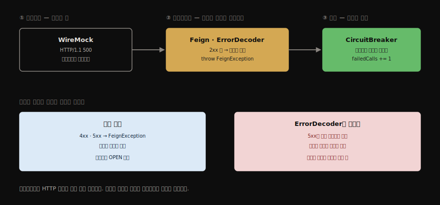
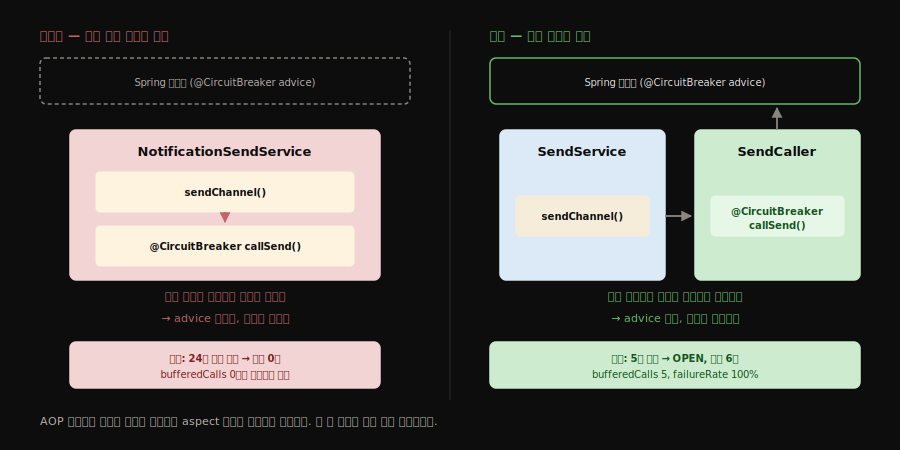

# 외부 호출과 회복 탄력성 — WireMock, Feign, CircuitBreaker

이 문서는 하나의 인과 사슬을 따라 씁니다: **목 서버가 500을 응답한다 → Feign이 그것을 예외로 번역한다 → CircuitBreaker가 실패로 세고 회로를 연다.** 세 요소는 따로 배우면 연결이 끊기고, 실패의 정의가 어디서 정해지는지 놓치게 됩니다. 근거는 UC-1 구현과 2026-07-20 실측 기록([learning/UC-1](../learning/UC-1-kafka-notification.md))입니다.

## 1. WireMock — 외부 벤더의 대역

> 실제 발송 벤더 없이 발송 경로를 끝까지 실행하고, 장애까지 마음대로 연출하는 목 서버입니다. 코드를 건드리지 않고 외부 상태만 바꿔 실험할 수 있다는 점이 핵심입니다.

실제 SMS·메일 벤더 대신 발송 요청을 받아주는 목 서버입니다. Feign의 `notification.send.base-url`이 `localhost:8110`을 가리키므로 외부 계약 없이 발송 경로를 끝까지 실행할 수 있고, 무엇보다 **장애를 마음대로 연출**할 수 있습니다.

**스텁(stub)** 은 "이 요청이 오면 이 응답을 줘라"라는 규칙이며 두 종류를 씁니다.

| 종류 | 정의 위치 | 수명 | 용도 |
|------|-----------|------|------|
| 파일 스텁 | `infra/wiremock/mappings/*.json` | 재시작해도 유지 | 기본 동작 — 발송 성공(200) |
| 런타임 스텁 | admin API로 주입 | 메모리에만 — 삭제·재시작 시 소멸 | 장애 연출 — `priority`를 낮은 숫자로 주면 파일 스텁보다 먼저 매칭 |

런타임 스텁이 실험 도구로 좋은 이유는 **소스도 설정 파일도 건드리지 않기 때문**입니다. 코드를 바꾸지 않고 외부 상태만 바꿔가며 우리 앱의 반응을 관찰할 수 있습니다.

```bash
# 장애 연출 — SMS 발송에 500 응답 (반환된 id를 메모해 둘 것)
curl -X POST localhost:8110/__admin/mappings -H "Content-Type: application/json" \
  -d '{"priority":1,"request":{"method":"POST","urlPath":"/send/sms"},"response":{"status":500}}'

# 원상복구
curl -X DELETE localhost:8110/__admin/mappings/<id>

# 등록된 스텁 확인
curl localhost:8110/__admin/mappings

# 요청 저널 — 이 엔드포인트에 몇 건이 실제로 도달했는가
curl -X POST localhost:8110/__admin/requests/count -H "Content-Type: application/json" \
  -d '{"method":"POST","urlPath":"/send/sms"}'
```

마지막 요청 저널이 특히 중요합니다. **"차단되었는가"를 판정하는 관측 지점**이기 때문입니다. 회로가 열렸다면 호출이 외부로 나가지 않으므로, 시도 횟수보다 도달 수가 적어야 합니다. 실측에서 이 차이(9번 시도 중 5건 도달)로 차단이 실재함을 확인했습니다.

지연 연출도 가능합니다 — 응답에 `"fixedDelayMilliseconds": 3000`을 넣으면 느린 외부를 흉내 냅니다. 3단계의 지연 실험에서 씁니다.


## 2. Feign — 500을 "실패"로 만드는 곳

> 상태코드 자체는 데이터일 뿐이고, 그것을 예외로 바꾸는 것은 클라이언트입니다. 실패의 정의가 프로토콜이 아니라 코드에 있다는 것이 이 절의 결론입니다.



HTTP 500이라는 숫자 자체는 그냥 데이터입니다. 그것을 예외로 바꾸는 것은 클라이언트입니다.

| 응답 | Feign 기본 동작 |
|------|----------------|
| 2xx | 정상 — 바디를 디코드해 반환 |
| 3xx | 보통 하부 HTTP 클라이언트가 리다이렉트를 따라감 |
| 4xx·5xx | `ErrorDecoder`로 넘어가고, 기본 구현이 `FeignException`을 던짐 |

예외 두 가지가 있습니다. `dismiss404` 옵션을 켜면 404만은 예외 대신 빈 값으로 받을 수 있고, `ErrorDecoder`를 커스텀하면 무엇을 실패로 볼지 직접 정의할 수 있습니다(예: 429를 재시도 가능한 예외로 번역).

여기서 중요한 결론이 나옵니다 — **실패의 정의는 프로토콜이 아니라 클라이언트 코드가 정합니다.** CircuitBreaker는 HTTP 코드를 보지 않고 "이 메서드가 예외로 끝났는가"만 봅니다. 500 → 예외 번역(Feign) → 실패 집계(CB)로 릴레이되는 구조입니다. Feign이 5xx를 예외로 바꾸지 않도록 설정하면, 외부가 계속 500을 줘도 회로는 영원히 닫혀 있습니다.

또한 Feign 자체 재시도는 기본 비활성입니다. UC-1에서 재시도를 담당하는 것은 Kafka 리스너 컨테이너 하나뿐입니다([kafka-message-handling §3](kafka-message-handling.md#3-재시도의-단위는-리스너-메서드-전체)).


## 3. CircuitBreaker — 무엇을 지키는 장치인가

> 반복 실패하는 외부 호출을 시도조차 하지 않는 상태로 전환해, 우리 앱의 자원과 상대 시스템의 회복 여유를 함께 지킵니다. Kafka 재시도와는 층이 달라 중복이 아닙니다.

전기 두꺼비집과 같습니다. 반복 실패하는 외부 호출을 **시도조차 하지 않는 상태**로 전환합니다.

| 상태 | 의미 |
|------|------|
| CLOSED | 정상 통과 (실패를 세는 중) |
| OPEN | 기준 초과 — 외부 호출 없이 즉시 예외(`CallNotPermittedException`) |
| HALF_OPEN | 대기 시간 후 시험 호출 몇 건만 통과시켜 회복 여부 판단 |

지키는 대상이 둘입니다. 하나는 **우리 앱**으로, 죽은 외부의 응답이나 타임아웃을 기다리며 스레드와 시간이 묶이는 것을 막습니다. 다른 하나는 **상대 시스템**으로, 장애 중인 서비스에 부하를 더 얹지 않고 회복할 틈을 줍니다.

UC-1 설정(`resilience4j.circuitbreaker.instances.notificationSend`)의 의미:

```yaml
sliding-window-size: 5                            # 최근 호출 5건을 기억
failure-rate-threshold: 50                        # 그중 50% 이상 실패면 OPEN
wait-duration-in-open-state: 10s                  # 10초 뒤 HALF_OPEN
permitted-number-of-calls-in-half-open-state: 2   # 시험 호출 2건
```

즉 최근 5건 중 3건이 실패하면 회로가 열립니다.

### 재시도와 중복이 아닌 이유

OPEN 상태에서도 Kafka 재시도는 그대로 돕니다. `CallNotPermittedException`은 컨테이너 입장에서 다른 예외와 구별되지 않는 그냥 "처리 실패"이기 때문입니다. 두 계층의 역할이 다릅니다.

| 계층 | 결정하는 것 |
|------|------------|
| CircuitBreaker | 이 **한 번의 시도**가 밖으로 나가도 되는가 |
| 리스너 컨테이너 | 이 **메시지**를 몇 번 시도하고 언제 포기(DLT)하는가 |

그리고 OPEN 중의 재시도는 거의 공짜입니다. 진짜 외부 호출이었다면 시도마다 타임아웃을 기다렸겠지만, 차단은 즉시 실패합니다. 죽은 외부를 향한 재시도 루프에서 컨슈머 스레드가 묶이는 시간을 CB가 줄여주므로, 둘은 중복이 아니라 상호보완입니다.


## 4. 어노테이션이 조용히 무력해지는 경우 — self-invocation

> 프록시 기반 어노테이션은 호출 경로가 프록시를 거치지 않으면 아무 일도 하지 않습니다. 오류도 경고도 없이 무시되므로, 동작 여부는 계기판으로만 확인할 수 있습니다.



`@CircuitBreaker`, `@Cacheable`, `@Transactional` 같은 어노테이션은 Spring이 빈을 **프록시로 감싸서** 동작합니다. 호출이 프록시를 거쳐 들어와야 부가 기능이 실행됩니다.

같은 객체 안에서 자기 메서드를 직접 호출하면 프록시를 우회하므로 어노테이션이 **아무 일도 하지 않습니다.** 컴파일 오류도 경고도 없이 조용히 무시되는 것이 이 문제의 위험한 점입니다.

```java
// 무력화되는 구조
class SendService {
    void sendChannel() {
        callSend();              // 같은 객체 → 프록시 우회 → CB 적용 안 됨
    }
    @CircuitBreaker(name = "x")
    SendResult callSend() { ... }
}

// 프록시를 거치는 구조
class SendService {
    private final SendCaller caller;     // 다른 빈
    void sendChannel() {
        caller.callSend();               // 프록시 경유 → CB 적용됨
    }
}
```

UC-1이 정확히 이 상태였습니다. 실측에서 24건 연속 실패에도 회로가 열리지 않고 모든 요청이 외부로 나갔습니다. `NotificationSendCaller`를 별도 빈으로 분리한 뒤 5건 만에 OPEN으로 전이했습니다.

원인이 하나 더 있었습니다 — **`spring-boot-starter-aop` 의존성이 없어 aspect 자체가 등록되지 않았습니다.** resilience4j 스타터만으로는 부족하며, 어노테이션 방식을 쓰려면 AOP 스타터가 함께 있어야 합니다.

프록시 우회를 피하는 방법은 세 가지입니다. 호출 대상을 **별도 빈으로 분리**(가장 표준적), `CircuitBreakerRegistry`를 주입받아 **코드로 감싸기**(프록시에 의존하지 않아 경계가 명시적), self-injection(동작은 하지만 구조가 어색해 권장하지 않음).

## 5. 회로 상태 관측

> 회로가 실제로 도는지 확인하는 유일한 수단입니다. `bufferedCalls`가 0에 머무는 것이 어노테이션 미동작을 알려주는 첫 신호입니다.

`spring-boot-starter-actuator`와 노출 설정이 있어야 상태를 볼 수 있습니다. 의존성이 없으면 엔드포인트가 404이고, 회로가 동작하는지 여부조차 확인할 수 없습니다.

```yaml
management:
  endpoints:
    web:
      exposure:
        include: health,info,circuitbreakers
```

```bash
curl -s localhost:8092/actuator/circuitbreakers
```

응답 필드를 읽는 법:

| 필드 | 의미 |
|------|------|
| `state` | CLOSED / OPEN / HALF_OPEN |
| `bufferedCalls` | 슬라이딩 윈도에 기록된 호출 수 — **0에서 안 늘면 어노테이션이 동작하지 않는다는 신호** |
| `failedCalls` / `failureRate` | 실패 수와 비율 (기준 초과 시 OPEN) |
| `notPermittedCalls` | 차단된 호출 수 — 0보다 크면 실제로 막고 있다는 뜻 |

`bufferedCalls`가 0에 머무는 것이 self-invocation 진단의 첫 단서입니다. 실패는 분명히 일어나는데 CB가 세지 않는다면, 호출이 프록시를 거치지 않는 것입니다.
