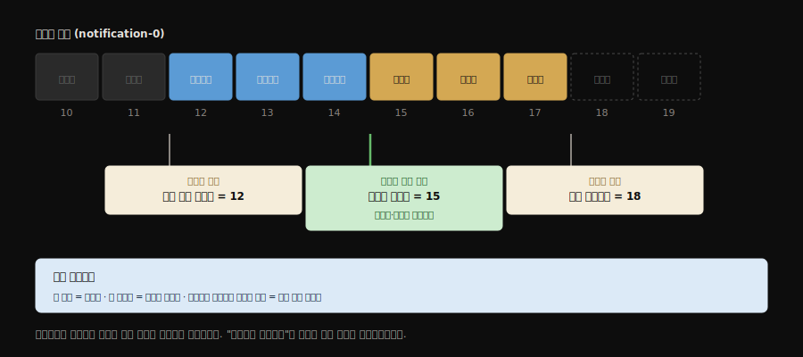
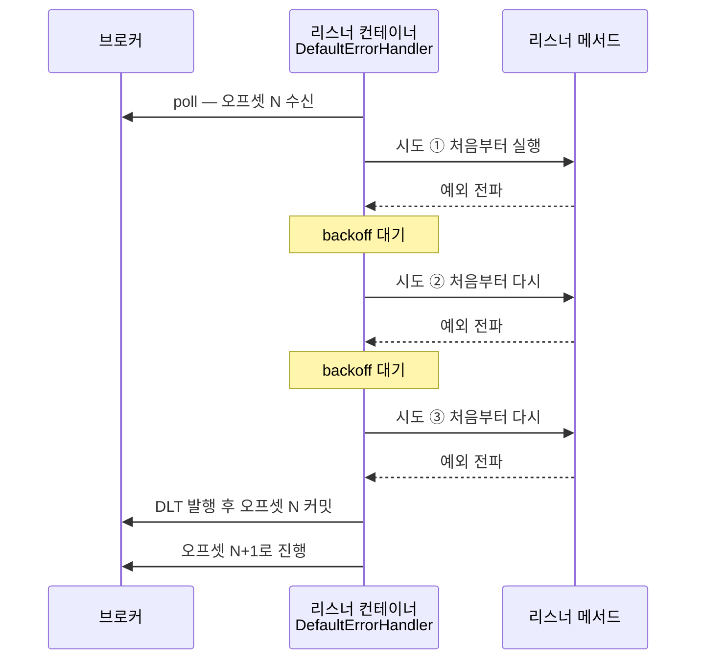

# Kafka 메시지 처리 — 오프셋, 재시도, DLT

이 문서는 "메시지 하나가 언제 완료로 취급되는가"를 축으로 씁니다. 이 질문에 답할 수 있으면 유실·중복·무한 재소비가 왜 생기는지도 함께 설명됩니다. 근거는 UC-1 구현과 2026-07-20 실측 기록([learning/UC-1](../learning/UC-1-kafka-notification.md))입니다.

## 1. 오프셋과 워터마크 — 좌표와 표식

> 같은 로그 위에 컨슈머의 표식과 브로커의 표식이 따로 놓입니다. "어디까지 처리했나"를 묻는 자리에는 커밋된 오프셋만 답할 수 있습니다.



**오프셋**은 파티션 로그 안에서 각 레코드가 갖는 일련번호, 즉 좌표입니다. 그 좌표 위에 서로 다른 주체가 목적이 다른 표식을 둡니다. 책에 비유하면 쪽 번호가 오프셋, 내 책갈피가 커밋된 오프셋, 출판사가 앞부분을 파기한 지점이 로그 시작 오프셋입니다.

| 표식 | 주인 | 의미 | 움직이는 때 |
|------|------|------|------------|
| 커밋된 오프셋 | 컨슈머 그룹 | "이 그룹은 여기까지 처리했다" | 리스너가 정상 리턴할 때 (`__consumer_offsets`에 저장) |
| 로그 시작 오프셋 (≈로우 워터마크) | 브로커 | "이 앞은 보존기간 만료로 삭제됐다" | retention이 옛 세그먼트를 지울 때 |
| 하이 워터마크 | 브로커 | "복제가 끝나 읽어도 안전한 지점" | 팔로워 복제가 따라올 때 |

재시도와 유실을 결정하는 것은 **커밋된 오프셋**입니다. 워터마크는 컨슈머가 읽었든 말든 브로커 사정으로 움직이므로, "어디까지 처리했나"를 묻는 자리에 워터마크를 대입하면 안 됩니다.

## 2. 언제 완료로 치는가 — auto-commit과 ack-mode

> 커밋 시점이 처리 성공과 묶여 있어야 유실이 없습니다. 자동 커밋을 끄고, 커밋 시점을 ack-mode로 정하고, 리스너에서 예외를 잡지 않는 세 가지가 한 세트입니다.

`enable-auto-commit: true`(Kafka 클라이언트 기본값)는 타이머 기반으로(기본 5초) 지금까지 poll한 지점을 자동 커밋합니다. 문제는 **커밋이 처리 성공과 아무 관계가 없다**는 점입니다. 레코드를 손에 쥐기만 하고 아직 처리하지 않았어도 커밋될 수 있고, 그 직후 앱이 죽으면 그 메시지는 완료 표시된 채 사라집니다.

`false`로 끄면 커밋 책임이 Spring 리스너 컨테이너로 넘어오고, 시점은 `ack-mode`가 정합니다.

| ack-mode | 커밋 시점 |
|----------|----------|
| RECORD | 레코드 하나를 처리(리스너 정상 리턴)한 직후 |
| BATCH (Spring 기본) | poll로 가져온 배치를 모두 처리한 후 |
| TIME / COUNT | 설정한 주기·건수 기준 |
| MANUAL / MANUAL_IMMEDIATE | 코드에서 `acknowledge()`를 직접 호출 |

이 프로젝트는 `enable-auto-commit: false` + `ack-mode: record`를 쓰고, 리스너는 예외를 잡지 않습니다. 세 가지가 한 세트로 **"처리에 성공한 레코드만 완료로 친다"** 를 만듭니다.

반대로 리스너가 예외를 try-catch로 삼키고 정상 리턴하면, 컨테이너 눈에는 성공이므로 커밋됩니다. 실패한 메시지가 성공으로 둔갑해 재시도도 DLT도 없이 사라집니다. 리스너에서 예외를 잡지 않는 것은 게으름이 아니라 설계입니다.

## 3. 재시도의 단위는 리스너 메서드 전체

> 컨테이너는 어느 단계에서 실패했는지 모르고 메서드를 처음부터 다시 실행합니다. 이 성질에서 부분 실패 시의 중복 발송이 따라 나옵니다.

재시도 장치는 리스너 컨테이너의 `DefaultErrorHandler` 하나뿐입니다. 예외가 역직렬화에서 났든 외부 호출에서 났든, 컨테이너는 실패한 안쪽 호출만 다시 부르지 않습니다. **같은 레코드로 리스너 메서드를 처음부터 다시** 실행합니다.

컨테이너가 아는 경계는 "리스너 메서드 호출" 하나이기 때문입니다. 그 안에서 몇 단계를 거쳤는지, 어디서 실패했는지는 알지 못하고 알 필요도 없습니다.



UC-1 설정은 `FixedBackOff(1000L, 2L)` — 1초 간격 재시도 2회(초기 시도 포함 총 3회)입니다. 실측에서 리스너 진입 로그가 레코드당 3번 찍히는 것으로 확인했습니다.

여기서 따라오는 함정이 있습니다. 한 이벤트에서 일부 채널만 실패하면, 재시도가 메서드를 처음부터 다시 돌리므로 **이미 성공한 채널도 다시 발송**됩니다. 멱등 처리(예: `eventId` 기반 중복 제거)가 없으면 중복 발송이 일어납니다.

## 4. DLT — 격리가 지키는 것

> 격리의 목적은 실패한 메시지가 아니라 뒤이은 메시지들의 진행입니다. 실패 원인은 앱 로그가 아니라 DLT 헤더에 남습니다.

재시도를 모두 소진하면 `DeadLetterPublishingRecoverer`가 레코드를 `{원본토픽}.DLT`로 보내고, 그 뒤 오프셋을 커밋해 다음 레코드로 진행합니다. 격리가 지키는 것은 실패한 메시지가 아니라 **파이프라인의 진행**입니다. 격리하지 않으면 처리 불가 메시지 하나가 파티션을 막고 무한 재소비로 컨슈머를 잡아먹습니다.

DLT 레코드에는 실패 원인이 헤더로 실립니다.

| 헤더 | 내용 |
|------|------|
| `kafka_dlt-exception-fqcn` | 최상위 예외 클래스 |
| `kafka_dlt-exception-cause-fqcn` | 근본 원인 클래스 (예: `JsonParseException`) |
| `kafka_dlt-exception-message` | 예외 메시지 |
| `kafka_dlt-exception-stacktrace` | 스택트레이스 |
| `kafka_dlt-original-topic` / `-partition` / `-offset` | 원본 위치 |

앱 로그에는 재시도 중 예외 스택이 남지 않으므로(INFO 수준 재시도 알림만 남음), **실패 원인 추적은 DLT 헤더가 1차 자료**입니다.

```bash
# 헤더까지 함께 보기
docker exec nlab-kafka /opt/kafka/bin/kafka-console-consumer.sh \
  --bootstrap-server kafka:9094 --topic notification.DLT \
  --from-beginning --timeout-ms 10000 --property print.headers=true
```

## 5. DLT 재처리 — 원인 해소가 먼저다

> 재처리는 자동으로 일어나지 않는 운영 행위입니다. 원인을 걷어내기 전에 다시 보내면 메시지는 DLT를 왕복만 합니다.

DLT는 보관소일 뿐이고, 재처리는 **DLT를 소비해 원본 토픽에 다시 발행하는 운영 행위**입니다. 자동으로 일어나지 않습니다.

재처리 전에 실패 성격을 먼저 가릅니다.

| 실패 성격 | 예 | 재처리하면 |
|-----------|-----|-----------|
| 일시적 외부 장애 | 발송 API 5xx, 타임아웃 | 원인이 걷힌 뒤 재발행하면 살아난다 |
| 영구적 데이터 결함 (독약 메시지) | JSON 아닌 본문, 스키마 불일치 | 몇 번을 재발행해도 같은 지점에서 죽는다 — 폐기하거나 형식을 고쳐야 한다 |

실측에서 5xx 희생자 이벤트를 세 번 재발행했지만 세 번 다 DLT로 돌아왔고, 네 번째에야 성공했습니다. 차이는 코드가 아니라 순서였습니다 — 앞의 세 번은 장애(500 스텁)가 살아 있는 상태에서 재처리한 것입니다. **원인이 해소되지 않은 재처리는 DLT 왕복만 만듭니다.**

```bash
# 특정 이벤트만 골라 재발행 (장애 해소를 먼저 확인할 것)
docker exec nlab-kafka /opt/kafka/bin/kafka-console-consumer.sh \
  --bootstrap-server kafka:9094 --topic notification.DLT \
  --from-beginning --timeout-ms 10000 2>/dev/null \
  | grep '"eventId":"evt-xxx"' | head -1 \
  | docker exec -i nlab-kafka /opt/kafka/bin/kafka-console-producer.sh \
      --bootstrap-server kafka:9094 --topic notification
```

운영에서는 이 과정을 사람이 매번 파이프로 잇지 않고 재처리 도구나 배치로 만듭니다. 그때도 판단 순서는 같습니다.

## 6. 처리 시간이 lag으로 번지는 이유

> 리스너 안에서 쓰는 시간은 전부 레코드당 처리 시간에 더해집니다. 캐시가 지연을 줄이는 자리도, 캐시가 옛 값을 주는 위험도 여기서 나옵니다.

컨슈머 스레드는 파티션의 레코드를 **순차적으로** 처리합니다. 리스너 메서드 안에서 일어나는 일은 그대로 레코드당 처리 시간에 더해집니다. 설정 조회, 외부 호출, 재시도 대기가 모두 여기에 해당합니다. 유입 속도가 처리 속도를 넘어서는 순간부터 lag이 쌓입니다.

그래서 채널 설정 조회 같은 반복 조회에 캐시를 둡니다. `@Cacheable`은 키가 캐시에 있으면 **메서드 본문을 아예 실행하지 않으므로**, 두 번째 조회부터 저장소 왕복이 사라집니다. 실측에서 같은 수신자의 두 번째 이벤트 처리 시간이 250ms에서 54ms로 줄었습니다.

캐시 미스가 나는 경우는 세 가지입니다: 최초 조회, TTL 만료(이 프로젝트는 `expireAfterWrite` 10분), 최대 크기 초과로 축출(`maximumSize(10_000)`).

주의할 점은 `@Cacheable`이 **원본 데이터 변경을 감지하지 않는다**는 것입니다. DB 값을 바꿔도 캐시는 모릅니다. 반영 수단은 TTL 만료, 쓰기 경로에서의 명시적 무효화(`@CacheEvict`), 변경 이벤트 구독 셋뿐이며, 현재 UC-1은 TTL에만 의존합니다. 설정 변경 API(UC-4)를 만들 때 `@CacheEvict`를 함께 넣어야 하는 이유입니다.

## 7. 앱이 살아 있어도 메시지는 멈출 수 있다

> 웹 계층과 메시지 계층은 따로 죽습니다. 파이프라인의 건강은 health 응답이 아니라 컨슈머 lag으로 판단합니다.

실습 중 겪은 상황입니다. `/actuator/health`는 200을 반환하는데 발행한 메시지가 처리되지 않았습니다. 원인은 컨슈머가 그룹 코디네이터를 찾지 못해 파티션을 할당받지 못한 상태였습니다. 웹 계층은 멀쩡했으므로 health는 UP이었습니다.

메시지 파이프라인의 건강은 health 엔드포인트가 아니라 **컨슈머 lag과 파티션 할당 상태**로 봅니다.

```bash
# 그룹 상태, 할당된 파티션, lag 한 번에 보기
docker exec nlab-kafka /opt/kafka/bin/kafka-consumer-groups.sh \
  --bootstrap-server kafka:9094 --describe --group notification-service
```

kafka-ui(`localhost:8100`)의 Consumers 화면에서도 같은 정보를 봅니다. Phase 3 관측 스터디의 UC-05(consumer lag)가 이 주제를 다룹니다.
