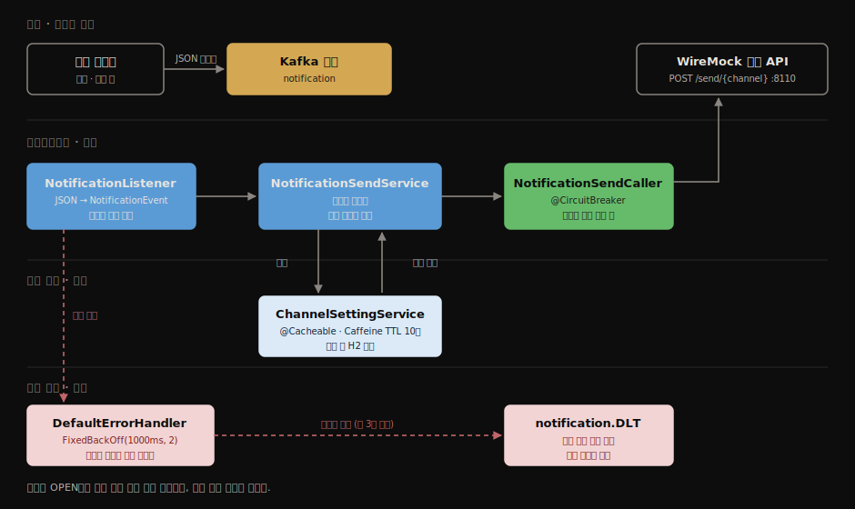
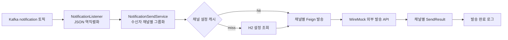
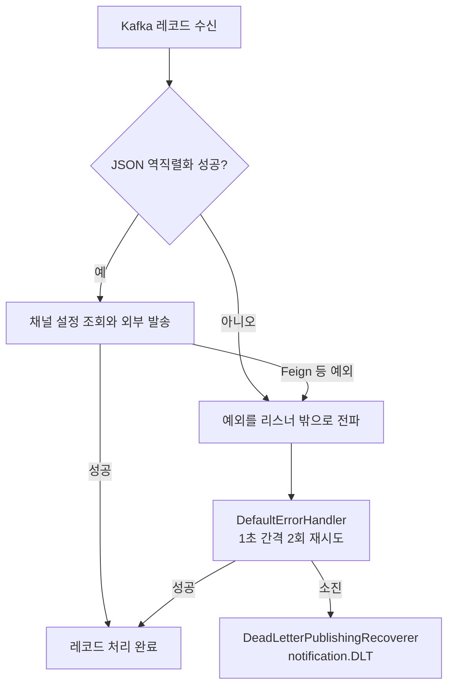
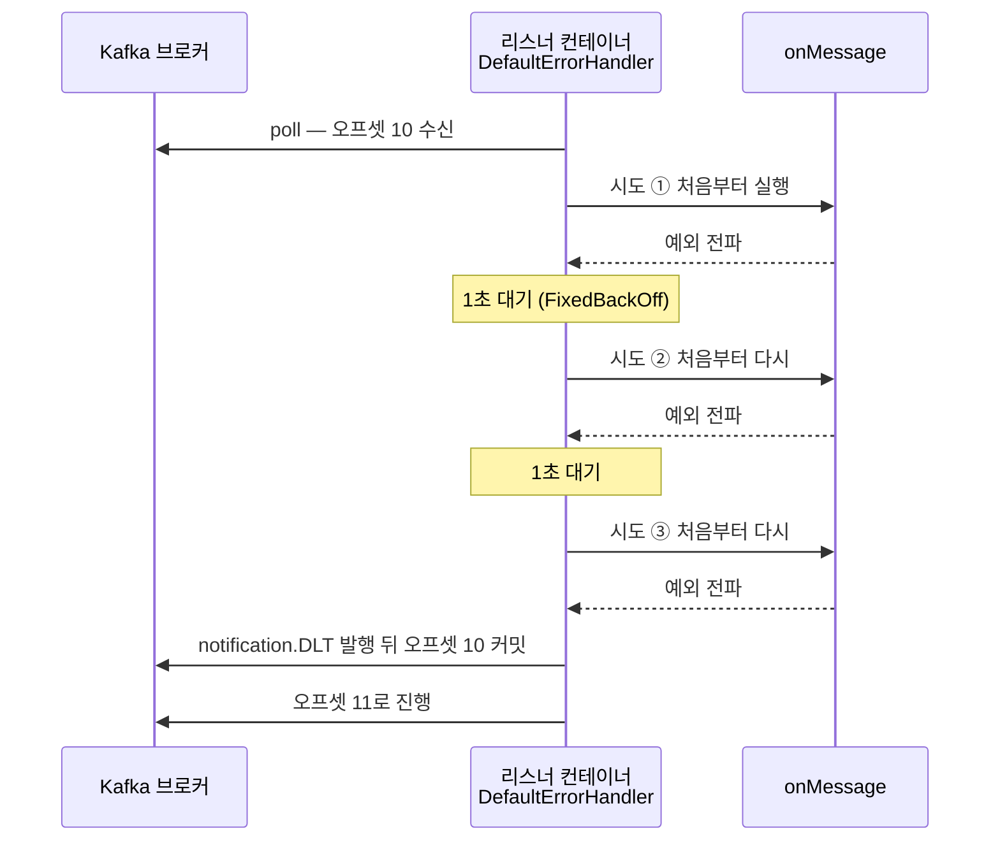
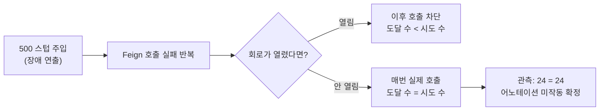

# UC-1 Kafka 알림 발송 — 구현 후 이해 기록

> 상태: **UC-1 마무리 완료 (2026-07-20)** — Phase 1~5 통과, 후속 검증 7건 전부 실측(확인 6·반증 후 수정 1). 다음 단계는 Phase 2-1 Testcontainers E2E로, 여기서 손으로 확인한 것을 자동 테스트로 박제합니다.

UC-1의 목표는 상류 시스템이 Kafka `notification` 토픽에 넣은 알림 이벤트를 채널별로 발송하고, 처리할 수 없는 메시지는 재시도 뒤 DLT로 격리하는 것입니다. 이 문서는 정상 발송만 확인한 수동 E2E와 현재 코드·설정을 구분해 읽습니다.

## 1. 구현 개요 — 먼저 읽는 지도

> 질의응답 전에 "무엇이 만들어졌는지"만 봅니다. 각 판단이 왜 그렇게 됐는지는 §4 이후의 Phase 질문에서 다룹니다.



| 구성요소 | 파일 (2026-07-22 send 헥사고날 전환 반영) | 하는 일 |
|----------|--------------------|---------|
| 진입점 | `send/api/NotificationListener.java` | `notification` 토픽 구독, 역직렬화 후 in-port 호출. 실패 집계를 예외로 번역해 재시도·DLT 발동 |
| 발송 서비스 | `send/application/NotificationSendService.java` | in-port 구현. 수신자를 `ChannelType`별로 그룹화, 수신 거부자 제외, 발송은 out-port에 위임 |
| 발송 포트 | `send/domain/port/` — in `SendNotificationUseCase` · out `ChannelSendPort` | 진입 계약(실패=집계 반환)과 발송 요구 계약 |
| 채널 설정 | `channel/application/ChannelSettingService.java` 외 | `(userId, channelType)` 수신 여부를 H2에서 조회, `@Cacheable`. 설정이 없으면 수신으로 간주. 2026-07-21 별도 컨텍스트로 헥사고날 분리 |
| 캐시 스펙 | `channel/infrastructure/config/CacheConfig.java` | Caffeine — TTL 10분, 최대 10,000개, `recordStats()` |
| 외부 호출 | `send/infrastructure/sendapi/NotificationSendClient.java` | OpenFeign `POST /send/{channel}` → WireMock(8110) |
| 실패 처리 | `send/infrastructure/config/KafkaConsumerConfig.java` | 리스너가 던진 예외를 1초 간격 2회 재시도, 소진 시 `notification.DLT` 적재 |
| 회로차단 | `send/infrastructure/sendapi/NotificationSendCaller.java` + `ChannelSendAdapter` | `@CircuitBreaker`(최근 5건 중 50%). Caller가 던진 예외를 어댑터가 실패 집계로 변환 |
| 데이터 계약 | `send/domain/model/` record 2종 + `common/domain/ChannelType` | `NotificationEvent`·`SendResult`. `ChannelType`은 세 컨텍스트 공유 커널로 승격 |

검증 상태: 정상 경로(SMS·EMAIL 각 1건이 WireMock에 도달)는 2026-07-09 수동 E2E로 확인됐습니다. 실패 경로·캐시 히트·회로 전이는 미실측입니다 — 상세는 아래 증거 등급 표를 봅니다.

## 2. 근거와 학습 범위

> 이 문서의 주장이 어느 자료에서 나왔는지 밝힙니다. 코드·실행 기록·명세를 각각 링크로 고정해, 나중에 사실이 바뀌면 어디를 다시 봐야 하는지 알 수 있게 합니다.

| 구분 | 근거 | 이 문서에서 다루는 것 |
|------|------|----------------------|
| 요구와 흐름 | [UC-1 명세](../02-actors-usecases.md#uc-1-kafka-알림-발송) | Kafka 수신, 채널별 발송, 실패 격리 |
| 코드 | [NotificationListener](../../src/main/java/com/practice/notification/send/api/NotificationListener.java), [NotificationSendService](../../src/main/java/com/practice/notification/send/application/NotificationSendService.java), [KafkaConsumerConfig](../../src/main/java/com/practice/notification/send/infrastructure/config/KafkaConsumerConfig.java) | 실제 호출 순서와 예외 전파 |
| 실행 기록 | [PROGRESS.md](../../PROGRESS.md) | SMS·EMAIL 두 채널의 정상 발송 수동 E2E |
| 실패 경로 노트 | [UC-1 DLT 관찰](../uc/UC-1-dlt.md) | 재시도·DLT 설정과 아직 남은 실측 |

이 학습 단위는 알림 기능을 새로 구현하는 단계가 아닙니다. 이미 완료된 Phase 1의 발송 파이프라인을 대상으로, 왜 이 순서와 실패 처리가 필요한지 설명할 수 있게 만드는 단계입니다.

## 3. 증거 등급

> 각 주장을 실행으로 본 것과 코드로 추론한 것으로 나눕니다. 이 구분이 없으면 "동작할 것이다"를 "동작한다"로 착각하고, 실패 경로를 운영 장애 때 처음 실측하게 됩니다.

등급은 근거의 강도입니다 — **확인됨**: 실행해서 관찰했다 · **코드상 추론**: 코드·설정상 그렇게 동작할 수밖에 없으나 실행으로 보진 않았다 · **미검증**: 코드를 읽어도 확신할 수 없다.

| 주장 | 등급 | 근거 |
|------|------|------|
| JSON 이벤트가 Kafka에서 소비되어 SMS·EMAIL 발송 요청이 WireMock에 각각 도달한다 | 확인됨 | 2026-07-09 수동 E2E 기록 |
| 성공 처리 뒤 리스너 컨테이너가 레코드 단위로 커밋을 관리한다 | 코드상 추론 | 설정(`enable-auto-commit: false`, `ack-mode: record`). 실패 레코드가 큐를 막지 않고 다음 레코드가 처리되는 것까지는 2026-07-20 실습에서 관측 |
| 역직렬화·발송 예외는 1초 간격 2회 재시도 뒤 `notification.DLT`로 간다 | **확인됨** | 2026-07-20 실측 — `Record in retry` 2줄이 1초 간격, 발행한 독약이 DLT에서 소비됨 (Phase 4 기록) |
| DLT 레코드는 실패 원인(예외 FQCN·메시지·스택)을 헤더로 싣는다 | **확인됨** | 2026-07-20 실측 — `kafka_dlt-exception-cause-fqcn: JsonParseException` 등 헤더 3종 소비 |
| 같은 `(userId, channelType)` 재조회는 DB를 건너뛴다 | **확인됨** | 2026-07-20 실측 — 2번째 이벤트에 "캐시 미스" 로그 없음, 처리 250ms→54ms |
| 외부 실패가 누적되면 CircuitBreaker가 OPEN으로 전이한다 | **수정 전 반증됨 → 수정 후 확인됨** | 2026-07-20 실측 — 수정 전에는 24건 연속 실패에도 차단 0회. `NotificationSendCaller` 분리 + AOP 스타터 추가 후 5건에서 OPEN, `notPermittedCalls: 6`, HALF_OPEN 회복까지 관측 |

## 4. Phase 1 · 맥락과 예측

> 코드를 보기 전에 설계 의도를 예측합니다. 예측을 먼저 세워야 코드를 읽을 때 자기 생각과 대조하며 읽게 됩니다.

**목표**: 코드를 보기 전에 이 파이프라인이 해결하려는 문제와 실패 가능성을 말해봅니다.

**출구 게이트**: 아래 질문에 답한 뒤에만 정상 흐름을 읽습니다. 답변은 대화에서 한 번에 하나씩 진행합니다.

1. 알림 이벤트를 HTTP 요청이 아니라 Kafka 토픽으로 받으면, 발송 서비스는 무엇을 분리할 수 있습니까?
2. 리스너가 예외를 잡아서 로그만 남기고 끝내면 Kafka 메시지에는 어떤 위험이 생깁니까?
3. SMS와 EMAIL 수신자가 한 이벤트에 섞여 있을 때, 외부 발송 호출을 채널별로 묶는 이유는 무엇입니까?

## 5. Phase 2 · 정상 발송 흐름

> 레코드 하나가 외부 발송 요청이 되기까지를 진입점부터 순서대로 읽습니다. 실패를 이해하려면 정상이 무엇인지가 먼저 있어야 합니다.

**목표**: 한 이벤트가 어디서 들어와 어떤 판단을 거쳐 외부 발송 요청이 되는지 순서대로 읽습니다.

**출구 게이트**: 아래 흐름을 보지 않고도 `listener → service → cache/DB → Feign` 순서와 각 단계의 이유를 설명합니다.



### 1. Kafka 레코드를 애플리케이션 이벤트로 바꿉니다

[`NotificationListener.onMessage`](../../src/main/java/com/practice/notification/send/api/NotificationListener.java)는 Kafka에서 `String` 메시지를 받고 `ObjectMapper`로 `NotificationEvent`를 만듭니다. 이 단계는 단순 변환이 아니라, 이후 서비스가 `eventId`, 제목, 내용, 수신자 목록이라는 도메인 데이터를 다루게 만드는 경계입니다.

메시지가 JSON이 아니면 이 메서드에서 예외가 납니다. 여기서는 예외를 잡지 않습니다. 실패를 성공처럼 끝내지 않고 리스너 컨테이너의 실패 처리로 넘기기 위해서입니다.

### 2. 수신자를 채널별 발송 단위로 묶습니다

[`NotificationSendService.send`](../../src/main/java/com/practice/notification/send/application/NotificationSendService.java)는 수신자를 `ChannelType`별로 그룹화합니다. 한 채널의 목적지를 한 `SendRequest`로 묶어 `/send/sms`, `/send/email`처럼 채널별 외부 API를 호출할 수 있게 합니다.

이 구조에서 발송 횟수는 수신자 수가 아니라 활성화된 채널 수에 가깝습니다. 같은 채널의 수신자가 여러 명이면 목적지 목록 하나로 발송합니다.

### 3. 채널 설정은 먼저 캐시에서 찾습니다

[`ChannelSettingService.isEnabled`](../../src/main/java/com/practice/notification/channel/application/ChannelSettingService.java)는 `(userId, channelType)`을 키로 `@Cacheable`을 사용합니다. 처음 조회하는 조합은 저장소를 읽고, 같은 조합의 다음 조회는 Caffeine 캐시를 사용합니다. 설정이 없으면 현재 구현은 `true`, 즉 수신 허용으로 간주합니다.

캐시는 외부 발송 자체를 빠르게 만드는 기능이 아니라, 반복되는 설정 조회가 저장소 병목으로 번지는 일을 줄이는 경계입니다. 수신 거부된 대상은 목적지 목록에서 빠지며, 한 채널의 목적지가 모두 비면 외부 API를 호출하지 않습니다.

### 4. 외부 발송 결과를 채널별로 합칩니다

[`NotificationSendCaller.callSend`](../../src/main/java/com/practice/notification/send/infrastructure/sendapi/NotificationSendCaller.java)는 채널 이름으로 경로를 정하고 Feign 클라이언트를 호출합니다. 성공하면 `SendResult`를 돌려주고, 리스너는 채널별 결과를 한 번의 완료 로그로 남깁니다. 이 메서드가 서비스가 아닌 별도 빈에 있는 이유는 아래 Phase 3에서 다룹니다.

수동 E2E에서 확인된 것은 SMS·EMAIL 두 호출이 WireMock에 도달했다는 정상 경로입니다. 캐시 히트, 외부 실패, DLT 적재는 이 실행에서 확인되지 않았습니다.

## 6. Phase 3 · 실패와 경계 추적

> 예외가 어디서 나서 어디로 전파되는지 추적하고, 각 주장에 증거 등급을 붙입니다. 이 단계에서 나온 "코드상 추론" 목록이 곧 다음 실측 실습의 대상이 됩니다.

**목표**: 실패가 발생한 위치에 따라 어떤 경로가 실행되고, 무엇을 아직 확인하지 못했는지 구분합니다.

**출구 게이트**: 한 실패 시나리오를 골라 예외 발생 위치, 재시도 여부, DLT 가능성, 증거 등급을 설명합니다.



### 실패를 삼키지 않는 이유

Kafka 소비 설정은 자동 커밋을 끄고 레코드 단위 커밋을 사용합니다. 처리 중 예외를 잡아 성공처럼 반환하면, 실패한 이벤트가 완료된 것처럼 취급되어 재처리나 DLT로 가지 못할 수 있습니다. 그래서 리스너는 역직렬화와 발송 예외를 그대로 전파합니다.

[`KafkaConsumerConfig`](../../src/main/java/com/practice/notification/send/infrastructure/config/KafkaConsumerConfig.java)는 `DefaultErrorHandler`에 1초 간격 2회 재시도를 설정합니다. 재시도가 모두 실패하면 `DeadLetterPublishingRecoverer`가 원본 파티션과 같은 번호의 `notification.DLT`로 레코드를 보냅니다. DLT를 다시 소비하거나 재처리하는 기능은 현재 범위에 없습니다.

2026-07-22 실패 계약 변경: 발송 실패는 이제 예외가 아니라 **실패 집계**(`SendResult.failed`)로 in-port에서 돌아오고, 리스너가 집계에 실패가 있으면 예외로 번역해 위 재시도→DLT를 발동시킵니다. 재시도·DLT 의미는 그대로이며, 같은 집계를 REST 입구(UC-2)는 207/502 응답 코드로 번역합니다 — 배경은 [UC-2 학습 문서의 반증 실측](UC-2-rest-dispatch.md#실측이-뒤집은-것--부분-실패는-207이-아니라-500입니다)을 봅니다.

### 재시도의 단위는 onMessage 전체입니다

재시도 장치는 리스너 컨테이너의 `DefaultErrorHandler` **하나뿐**입니다. 예외가 역직렬화(`objectMapper.readValue`)에서 났든 Feign 호출(`sendClient.send`)에서 났든, 컨테이너는 실패한 안쪽 호출만 다시 부르는 게 아니라 **같은 레코드로 `onMessage`를 처음부터 다시** 실행합니다. Feign 자체 재시도는 기본 비활성이고 Resilience4j `@Retry`도 없으므로, 안쪽에 별도 재시도 계층은 없습니다.



이 구조의 귀결이 하나 있습니다. 한 이벤트에서 SMS 발송은 성공하고 EMAIL이 실패하면, 재시도는 `onMessage`를 처음부터 다시 실행하므로 **성공했던 SMS까지 다시 발송**합니다. 현재 코드에는 채널별 부분 성공을 기억하는 장치나 `eventId` 기반 멱등 처리가 없어, 부분 실패 재시도에서 중복 발송이 일어날 수 있습니다(코드상 추론).

### CircuitBreaker는 설정과 실행을 구분해 읽습니다

> 이 절은 Phase 3 당시의 진단을 남겨둡니다. 진단이 실험으로 확정되고 코드가 수정된 경위는 Phase 4의 수정·재검증 기록에 있습니다.

`callSend()`에는 `@CircuitBreaker(name = "notificationSend")`가 있고, 설정에는 최근 5건 기준 50% 실패 시 OPEN 전이를 의도한 값이 있었습니다. 하지만 당시 코드는 `sendChannel()`이 같은 `NotificationSendService` 객체 안에서 `callSend()`를 직접 호출했습니다.

Spring의 일반적인 프록시 AOP는 객체 내부 호출을 프록시 밖의 직접 호출로 처리하므로 조언을 적용하지 않습니다. [Spring AOP 문서](https://docs.spring.io/spring-framework/reference/core/aop/proxying.html#spring-aop-proxying)도 self-invocation이 advice를 우회한다고 설명합니다. AspectJ weaving 설정도 없었으므로, 회로차단기가 실제 OPEN으로 전이한다는 주장을 그때는 **미검증**으로 두었습니다.

읽는 순서에 주의합니다. 이 진단은 코드를 읽어 세운 가설입니다. 실측이 그것을 확정했고(24건 실패에도 차단 0회), 수정 뒤 재실험이 원인 귀속까지 증명했습니다(5건에서 OPEN). 가설과 관측과 확정을 뭉뚱그리지 않는 것이 이 문서의 규칙입니다.

## 7. 후속 검증

> Phase 3까지 미검증으로 남은 항목과 그 처리 결과입니다. 실측을 마친 항목은 완료로, 아직 남은 항목은 확인 기준과 함께 둡니다.

| 항목 | 상태 | 기준·결과 |
|------|------|-----------|
| 독약 메시지의 DLT 적재 | ✅ 완료 (2026-07-20) | 재시도 2회 뒤 DLT 레코드·실패 헤더 확인 — Phase 4 실험 A |
| 외부 5xx의 재시도와 DLT | ✅ 완료 (2026-07-20) | WireMock 500 → 3회 시도 → DLT 적재 확인 — Phase 4 실험 B |
| 캐시 히트 | ✅ 완료 (2026-07-20) | 2번째 조회에서 저장소 접근 없음 — Phase 4 실험 C |
| CircuitBreaker 프록시 경계 | ✅ 완료 (2026-07-20) | `NotificationSendCaller` 분리 + AOP 스타터 추가 → CLOSED→OPEN→HALF_OPEN 전이와 차단 6건 실측 |
| CB 관측 수단(`/actuator/circuitbreakers` 404) | ✅ 완료 (2026-07-20) | actuator 의존성 추가 → 상태·카운터 조회 가능 |
| 부분 실패 시 중복 발송 | ✅ **확인됨 (2026-07-20)** | SMS만 500으로 만든 뒤 SMS·EMAIL 2채널 이벤트 발행 → **성공한 EMAIL이 3회 발송**(WireMock 도달 3건), SMS도 3회 시도 후 DLT. `eventId` 기반 멱등 처리 필요 — 설계는 별도 작업 |
| 캐시 무효화 부재의 영향 | ✅ **확인됨 (2026-07-20)** | 캐시에 허용이 올라간 뒤 DB에 거부 행을 넣었으나 **발송이 그대로 진행됨**(EMAIL 도달 4→5, 캐시 미스 로그 없음). TTL 10분 전까지 옛 값 사용 — UC-4 CRUD에서 `@CacheEvict` 필수 |

## 8. Phase 4 · 실측 실습 기록 (2026-07-20)

> 추론으로 남아 있던 주장을 실제로 돌려 확인하거나 반증합니다. 이 단계에서 회로차단기가 동작하지 않는다는 것이 드러나 코드 수정으로 이어졌습니다.

Phase 3까지 "코드상 추론"이던 주장을 로컬에서 실험해 등급을 승격·반증했습니다. 조작은 메시지 발행과 WireMock 런타임 스텁뿐이며 소스는 수정하지 않았습니다.

### WireMock이 실험 도구인 이유

WireMock은 실제 발송 벤더 API의 대역입니다. Feign의 `notification.send.base-url`이 가리키는 8110에서 요청을 받아 `infra/wiremock/mappings/send-success.json`의 파일 스텁(200 성공)으로 응답합니다. 실험에서는 두 기능을 더 썼습니다.

- **런타임 스텁**: `POST /__admin/mappings`로 "SMS 요청엔 500을 줘라"를 우선순위 높게 주입하면 그 순간부터 외부 장애가 연출됩니다. 메모리에만 존재하므로 삭제(또는 재시작)하면 원상복구됩니다.
- **요청 저널**: WireMock은 받은 요청을 기록하므로 `POST /__admin/requests/count`로 "발송 요청이 몇 건 도달했나"를 셀 수 있습니다. 회로차단 판정의 관측 지점이 이것입니다.

### 실험 결과

| 실험 | 조작 | 관찰 | 판정 |
|------|------|------|------|
| A 독약 메시지 | JSON 아닌 문자열 발행 | `Record in retry` 2줄 1초 간격 → DLT에서 그 문자열 소비, 예외 헤더 3종 확인 | 재시도·DLT 격리 **확인됨** |
| C 캐시 히트 | 같은 수신자 이벤트 2건 연속 발행 | 2번째에 "캐시 미스" 로그 없음, 처리 250ms→54ms | 캐시 효과 **확인됨** |
| B 외부 5xx | 500 스텁 주입 후 SMS 이벤트 발행 | 이벤트당 "수신" 로그 3번(onMessage 전체 재실행 물증) → DLT. **24건 연속 실패에도 요청 전부 도달 = 회로 개입 0회** | 실패 경로 확인됨 · **CB 무력 반증** |

### 실험 B의 판정 논리



`/actuator/circuitbreakers`가 404(엔드포인트 미등록)라 회로 상태를 직접 볼 수 없어, 도달 카운트를 대리 관측으로 썼습니다. 이 404 자체도 수정 대상입니다.

### 수정과 재검증 (실습 직후)

반증된 회로차단을 고치고 같은 실험을 다시 돌려 확정했습니다. 수정은 두 곳입니다.

- `remote/NotificationSendCaller` 신설 — `@CircuitBreaker`가 붙은 `callSend`를 별도 빈으로 분리해, 호출이 반드시 프록시를 거치게 했습니다. 서비스는 이 빈에 위임합니다.
- `build.gradle` — `spring-boot-starter-aop`(어노테이션 aspect 등록)와 `spring-boot-starter-actuator`(회로 상태 관측)를 추가했습니다.

| 관측 | 수정 전 | 수정 후 |
|------|---------|---------|
| `/actuator/circuitbreakers` | 404 (엔드포인트 없음) | 200 — 상태·카운터 조회 가능 |
| 연속 실패 시 회로 | 24건 실패에도 CLOSED | 5건에서 **OPEN** (failureRate 100%) |
| 차단된 호출 | 0 | `notPermittedCalls: 6` |
| WireMock 도달 수 | 시도 수와 동일(24=24) | 9시도 중 **5건만 도달**(누적 29) — 차단이 실재 |
| 회복 | 관측 불가 | OPEN → 10초 → **HALF_OPEN**(시험 1/2 성공) → CLOSED |

### DLT 재처리에서 배운 것

DLT는 보관소일 뿐이고 재처리는 "DLT를 소비해 원토픽에 재발행하는" 운영 행위입니다. 실습에서 `evt-v1`을 세 번 재발행했지만 세 번 다 다시 DLT로 갔고, 네 번째에야 성공했습니다. 차이는 코드가 아니라 순서였습니다 — 앞의 세 번은 500 스텁이 살아 있는 상태, 즉 **원인이 해소되기 전에 재처리**한 것입니다.

그래서 재처리 판단은 실패 성격을 먼저 가릅니다. 일시적 장애의 희생자(외부 5xx)는 원인이 걷힌 뒤 재발행하면 살아나지만, 독약 메시지(역직렬화 불가)는 몇 번을 재발행해도 같은 지점에서 죽으므로 폐기하거나 형식을 고쳐야 합니다.

### 부분 실패 실험 (2026-07-20 추가)

재시도 단위가 리스너 메서드 전체라는 사실의 귀결을 직접 확인했습니다. SMS만 500으로 만들고 SMS·EMAIL 수신자가 섞인 이벤트 하나를 발행했습니다.

| 채널 | 결과 | WireMock 도달 |
|------|------|---------------|
| EMAIL | 매 시도마다 성공 | **3건** — 성공했는데도 3번 발송 |
| SMS | 매 시도마다 500 | 3건 → 재시도 소진 후 DLT |

수신 로그도 3줄이었습니다. 컨테이너는 "이 레코드 처리 실패"만 알 뿐 어느 채널이 성공했는지 모르므로, 이미 성공한 EMAIL을 되돌리지도 기억하지도 않고 메서드를 처음부터 다시 실행합니다. 실제 수신자라면 같은 메일을 3통 받습니다.

원인은 둘이 겹친 것입니다 — 재시도 단위가 채널이 아니라 메시지 전체라는 점, 그리고 `eventId`가 로그에만 쓰이고 멱등 처리에 활용되지 않는다는 점입니다. 해결 방향(채널별 처리 상태 기록, `eventId` 기반 중복 제거, 발송 결과의 부분 커밋)은 별도 설계 작업으로 분리합니다.

### 캐시 무효화 실험 (2026-07-20 추가)

`@Cacheable`이 원본 데이터 변경을 감지하지 않는다는 것을 확인했습니다. 순서는 이렇습니다.

1. 설정 행이 없는 수신자로 발송 → `orElse(true)`(허용)가 캐시에 저장 (EMAIL 도달 3→4)
2. H2에 `(u-cache, EMAIL, ENABLED=FALSE)` 행을 직접 삽입 — **DB는 거부, 캐시는 허용**으로 어긋난 상태
3. 같은 수신자로 재발송 → **거부를 무시하고 발송됨** (도달 4→5). 로그에 "캐시 미스"가 없어 DB를 아예 읽지 않았음이 확인됨

운영으로 옮기면 "사용자가 수신 거부를 눌렀는데 알림이 계속 온다"가 됩니다. 현재 반영 수단은 TTL 10분 만료뿐이므로, 설정 변경 API(UC-4)를 만들 때 쓰기 경로에 `@CacheEvict`를 함께 넣어야 합니다.

### 부수 발견

- 재시도 중 실패의 예외 스택은 앱 로그에 남지 않습니다(INFO "Record in retry"뿐). 원인 추적은 DLT 헤더로만 가능 — 관측 스터디(Phase 3 로드맵)의 소재입니다.
- 실패 이벤트의 재시도에서 첫 시도가 캐싱한 설정이 캐시 히트로 재사용됐습니다(시도②③에 미스 로그 없음).


## 9. Phase 5 · 능동 인출과 자기 설명

> 문서를 보지 않고 흐름과 실패 원인을 자기 언어로 설명합니다. 읽어서 이해한 것과 꺼낼 수 있는 것은 다르므로, 이 단계를 통과해야 다음 UC로 넘어갑니다.

**목표**: 문서를 보지 않고 UC-1의 인과관계를 설명합니다.

**출구 게이트**: 다섯 질문을 대화에서 한 번에 하나씩 답하고, 마지막에 정상·실패 경로와 후속 검증을 자기 언어로 설명합니다.

### Q1. 정상 경로

Kafka `notification` 레코드 하나가 WireMock 발송 요청에 이르기까지의 순서를 설명해 보세요. 채널별 그룹화와 캐시가 어느 지점에 들어가는지도 포함하세요.

### Q2. 커밋과 예외

`NotificationListener`가 예외를 잡지 않는 이유를 `enable-auto-commit`과 `ack-mode: record`의 의도와 연결해 설명해 보세요.

### Q3. 캐시의 역할

같은 사용자의 같은 채널 설정을 두 번 조회할 때, 캐시 히트와 미스는 각각 어떤 경로를 지나며 왜 consumer 처리 지연에 영향을 줄 수 있습니까?

### Q4. DLT와 회로차단의 구분

DLT 적재와 CircuitBreaker OPEN은 모두 실패와 관련 있지만 역할이 다릅니다. 각각 무엇을 격리하거나 차단하려는지, 현재 UC-1에서 무엇이 실제 검증됐는지 설명해 보세요.

### Q5. 실패 시나리오 설명

잘못된 JSON 또는 WireMock 5xx 중 하나를 골라, 예외 발생 지점부터 재시도와 DLT까지의 경로를 설명하세요. 설명 중 확인됨·코드상 추론·미검증을 하나씩 구분하세요.


## 10. 실전 사용 — 운영에서 쓰는 판단과 명령

> 이 파이프라인을 운영할 때 실제로 내려야 하는 판단과, 그 판단에 필요한 관측 명령을 모읍니다. 실습에서 겪은 함정을 그대로 옮겼습니다.

### 상태를 확인하는 명령

파이프라인이 건강한지는 `/actuator/health`로 판단하지 않습니다. 실습에서 health가 200을 반환하는 동안 컨슈머가 파티션을 할당받지 못해 메시지가 전혀 처리되지 않은 적이 있습니다. 웹 계층과 메시지 계층은 따로 죽습니다.

```bash
# 컨슈머 그룹 상태와 lag — 파이프라인 건강의 1차 지표
docker exec nlab-kafka /opt/kafka/bin/kafka-consumer-groups.sh \
  --bootstrap-server kafka:9094 --describe --group notification-service

# 회로 상태 — bufferedCalls가 0에서 안 늘면 어노테이션이 동작하지 않는 신호
curl -s localhost:8092/actuator/circuitbreakers

# DLT에 쌓인 실패와 원인 헤더
docker exec nlab-kafka /opt/kafka/bin/kafka-console-consumer.sh \
  --bootstrap-server kafka:9094 --topic notification.DLT \
  --from-beginning --timeout-ms 10000 --property print.headers=true
```

### 주의사항

DLT 재처리는 원인을 해소한 뒤에 합니다. 실습에서 같은 이벤트를 세 번 재발행했지만 세 번 다 DLT로 돌아왔고, 장애를 걷어낸 네 번째에야 성공했습니다. 재처리 전에 실패 성격부터 가릅니다 — 외부 5xx 같은 일시적 장애는 재처리로 살아나지만, 역직렬화 불가 메시지는 몇 번을 보내도 같은 지점에서 죽습니다.

어노테이션 기반 회로차단은 조용히 무력해질 수 있습니다. 같은 객체 안에서 자기 메서드를 호출하면 프록시를 우회하고, `spring-boot-starter-aop`가 없으면 aspect 자체가 등록되지 않습니다. 둘 다 컴파일 오류나 경고 없이 통과하므로, `bufferedCalls`가 실제로 증가하는지 확인하는 것이 유일한 검증 수단입니다.

채널 설정을 바꿔도 최대 10분(`expireAfterWrite`)간 옛 값으로 발송됩니다. 설정 변경 API를 만들 때 `@CacheEvict`를 함께 넣지 않으면 "수신 거부를 눌렀는데 알림이 계속 온다"가 됩니다.


## 11. 면접 대비 요약

> 이 UC에서 설명할 수 있어야 하는 것을 한 자리에 모읍니다. 문서를 덮고 이 절만으로 답할 수 있으면 이해가 자리 잡은 것입니다.

### 한 줄 정의

UC-1은 Kafka로 받은 알림 이벤트를 채널별로 묶어 외부 발송 API에 전달하고, 처리할 수 없는 메시지는 재시도 뒤 DLT로 격리하는 소비 파이프라인입니다.

### 핵심 포인트 3가지

1. **완료의 정의가 유실을 막습니다.** `enable-auto-commit: false` + `ack-mode: record` + 리스너에서 예외를 잡지 않는 것, 이 세 가지가 한 세트로 "처리에 성공한 레코드만 커밋한다"를 만듭니다. 예외를 삼키면 실패가 성공으로 둔갑해 재시도도 DLT도 없이 사라집니다.
2. **재시도 단위는 메시지 전체입니다.** 컨테이너가 아는 경계는 리스너 메서드 하나뿐이므로, 어디서 실패했든 메서드를 처음부터 다시 실행합니다. 그래서 일부 채널만 실패해도 성공한 채널이 다시 발송됩니다.
3. **재시도와 회로차단은 층이 다릅니다.** 회로차단은 "이 한 번의 시도를 밖으로 내보낼지"를, 컨테이너는 "이 메시지를 몇 번 시도하고 언제 포기할지"를 정합니다. 중복이 아니라 상호보완입니다.

### 자주 묻는 질문

**Q. 리스너에서 예외를 잡으면 안 되는 이유는?**
A. 잡아서 정상 리턴하면 컨테이너는 성공으로 보고 오프셋을 커밋합니다. 실패한 메시지가 완료로 기록되어 재시도 대상에서도 DLT에서도 빠지므로, 조용히 유실됩니다.

**Q. DLT에 쌓인 메시지는 자동으로 재처리되나요?**
A. 아닙니다. DLT는 보관소일 뿐이고 재처리는 DLT를 소비해 원본 토픽에 다시 발행하는 운영 행위입니다. 원인이 해소되지 않은 재처리는 DLT 왕복만 만듭니다.

**Q. 회로가 열렸는데도 Kafka 재시도가 도나요?**
A. 돕니다. `CallNotPermittedException`은 컨테이너 입장에서 다른 예외와 구별되지 않는 처리 실패이기 때문입니다. 다만 외부 호출 없이 즉시 실패하므로, 타임아웃을 기다리는 재시도보다 컨슈머 스레드가 훨씬 적게 묶입니다.

**Q. 캐시가 왜 consumer lag에 영향을 줍니까?**
A. 컨슈머 스레드는 파티션의 레코드를 순차 처리하므로, 리스너 안에서 일어나는 설정 조회가 그대로 레코드당 처리 시간에 더해집니다. 캐시 히트로 저장소 왕복이 사라지면서 실측에서 처리 시간이 250ms에서 54ms로 줄었습니다.

## 부록 · 대화에서 나온 개념 정리

> 아래는 이 UC를 읽는 데 필요한 최소 설명입니다. UC에 매이지 않는 개념 정리는 [concepts/](../concepts/00-index.md)로 옮겼습니다 — [Kafka 메시지 처리](../concepts/kafka-message-handling.md), [외부 호출과 회복 탄력성](../concepts/external-call-and-resilience.md).

### 오프셋과 워터마크 — 좌표와 표식

**오프셋**은 파티션 로그 안에서 레코드가 갖는 일련번호, 즉 좌표입니다. 그 좌표 위에 서로 다른 주체가 목적이 다른 표식을 둡니다. 책에 비유하면 쪽 번호(오프셋), 내 책갈피(커밋된 오프셋), 출판사가 앞부분을 파기한 지점(로그 시작 오프셋)입니다.

| 표식 | 주인 | 의미 | 움직이는 때 |
|------|------|------|------------|
| 커밋된 오프셋 | 컨슈머 그룹 | "이 그룹은 여기까지 처리했다" | 리스너 정상 리턴 시 (`__consumer_offsets`에 저장) |
| 로그 시작 오프셋 (≈로우 워터마크) | 브로커 | "이 앞은 보존기간 만료로 삭제됨" | retention이 옛 세그먼트를 지울 때 |
| 하이 워터마크 | 브로커 | "복제가 끝나 읽어도 안전한 지점" | 팔로워 복제가 따라올 때 |

재시도·유실을 결정하는 것은 커밋된 오프셋입니다. 로우 워터마크는 컨슈머가 읽었든 말든 시간이 지나면 올라갑니다.

### enable-auto-commit과 ack-mode — "언제 완료로 치는가"

`enable-auto-commit: true`(Kafka 기본)는 타이머 기반(기본 5초)으로 poll한 지점까지 자동 커밋합니다. 커밋이 처리 성공과 연결되지 않아, 처리 전에 커밋된 메시지는 앱이 죽으면 유실됩니다. `false`로 끄면 커밋 책임이 리스너 컨테이너로 넘어오고, 시점은 ack-mode가 정합니다.

| ack-mode | 커밋 시점 |
|----------|----------|
| RECORD ← 이 프로젝트 | 레코드 하나 처리(정상 리턴) 직후 |
| BATCH (Spring 기본) | poll 배치 전체 처리 후 |
| TIME / COUNT | 주기·건수 기반 |
| MANUAL / MANUAL_IMMEDIATE | 코드에서 `acknowledge()` 직접 호출 |

`auto-commit off + ack-mode: record + 예외 안 잡기`가 한 세트로 "처리 성공만 완료로 친다"를 만듭니다. 예외를 삼키면 정상 리턴 = 커밋 = 실패가 성공으로 둔갑합니다.

### CircuitBreaker 상태 — "회로를 연다"의 뜻

전기 두꺼비집 비유 그대로, 반복 실패하는 외부 호출을 시도조차 하지 않는 상태로 전환하는 장치입니다. 죽은 외부를 기다리며 스레드·시간을 태우는 것을 막고, 상대에게 회복할 틈을 줍니다.

| 상태 | 의미 |
|------|------|
| CLOSED | 정상 통과 (실패를 세는 중) |
| OPEN | 기준 초과 — 즉시 실패 처리, 외부 호출 없음 |
| HALF_OPEN | 대기 후 시험 호출 몇 건만 통과시켜 회복 판단 |

이 프로젝트 기준: 최근 5건(`sliding-window-size`) 중 50%(`failure-rate-threshold`) 이상 실패 시 OPEN → 10초(`wait-duration-in-open-state`) 후 HALF_OPEN에서 2건(`permitted-number-of-calls-in-half-open-state`) 시험.

## 완료 기록

> 각 단계의 출구 게이트를 통과한 시점을 남깁니다. 대화형 확인을 마친 뒤에만 완료로 바꿉니다.

- [x] Phase 1: 목적과 실패 가능성을 예측했습니다. (2026-07-20)
- [x] Phase 2: 정상 흐름을 코드 없이 설명했습니다. (2026-07-20)
- [x] Phase 3: 실패 경로와 증거 등급을 구분했습니다. (2026-07-20)
- [x] Phase 4: 실측 실습으로 추론을 확인·반증했습니다 — A 독약·B 외부 5xx·C 캐시. (2026-07-20)
- [x] Phase 5: 다섯 질문과 자기 설명을 완료했습니다. (2026-07-20)

모든 항목은 대화형 확인을 마친 뒤에만 완료로 바꿉니다. 다음 UC는 이 설명이 끝난 뒤 진행합니다.
