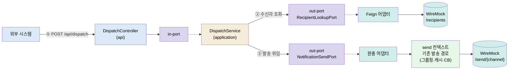
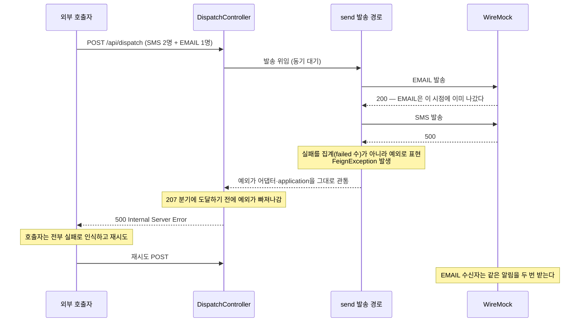

# UC-2 · 외부 REST 발송 — dispatch 컨텍스트, 수신자 조회, 동기 집계

> 외부 시스템이 REST 한 번으로 "이 그룹에게 이 알림을 보내라"를 요청하는 흐름(FR-6)을 학습 단위로 다룹니다. UC-1(Kafka 트리거)과 같은 발송 경로를 재사용하되, 앞단에 수신자 조회가 하나 더 붙고 결과를 동기로 집계해 응답 코드로 돌려준다는 점이 다릅니다.

- 근거: 구현 커밋 `3245e12`, 2026-07-21 스모크 실측, [UC-2 리뷰 노트](../uc/UC-2.md)
- 연결: [UC-1 학습 문서](UC-1-kafka-notification.md)(재사용되는 발송 경로) · [UC-4 학습 문서](UC-4-channel-setting.md)(같은 헥사고날 컨벤션) · [컨벤션](../../../../AGENTS.md)

## 구현 개요 — 먼저 읽는 지도

구현 범위는 셋입니다. ① `POST /api/dispatch` REST 계약과 응답 코드 규칙, ② 수신자 조회 API(WireMock 모사) 연동, ③ 기존 발송 경로 재사용 — 전부 헥사고날 `dispatch` 컨텍스트에 담았습니다.

| 구성요소 | 파일 | 역할 |
|---|---|---|
| REST 어댑터 | `dispatch/api/DispatchController.java` | POST /api/dispatch. 집계 결과로 응답 코드 결정 |
| 요청/응답 DTO | `dispatch/api/DispatchRequest·Response.java` | `{groupId, title, content}` / 채널별 집계 |
| 유스케이스 구현 | `dispatch/application/DispatchService.java` | 수신자 조회 → 발송 위임, out-port 2개 조합 |
| in-port | `dispatch/domain/port/in/DispatchNotificationUseCase.java` | REST 어댑터의 진입 인터페이스 |
| 도메인 모델 | `dispatch/domain/model/Recipient·ChannelDispatchResult.java` | 순수 POJO. send의 SendResult와 분리된 자체 결과 타입 |
| out-port 2개 | `dispatch/domain/port/out/RecipientLookupPort·NotificationSendPort.java` | 수신자 조회 요구 / 발송 요구 — 도메인이 선언 |
| 조회 어댑터 | `dispatch/infrastructure/recipient/RecipientLookupClient·Response·Adapter.java` | Feign으로 `GET /recipients/{groupId}` 호출. 2026-07-22 대상별 하위 패키지로 재배치 |
| 발송 완충 어댑터 | `dispatch/infrastructure/send/NotificationSendAdapter.java` | NotificationEvent(`rest-UUID`) 조립 후 send의 기존 발송 서비스에 위임 |

응답 코드 규칙: 수신자 없음 **404** · 전 채널 성공 **200** · 일부 실패 **207**(Multi-Status) · 전부 실패 **502**.

검증 상태: 200 집계·400·404와 조회→발송 연쇄는 스모크로 실행 확인했고, 207/502 경로와 조회 API 장애 시 동작은 아직 실행으로 보지 않았습니다(아래 표).

## 실측이 뒤집은 것 — 부분 실패는 207이 아니라 500입니다

> Phase 4 실측(2026-07-22, 학습자 직접 재현 포함)이 응답 코드 규칙의 절반을 반증했습니다. 발송 실패가 집계가 아니라 예외로 표현되는 send 구조 때문에, 207·502 분기는 실행이 도달할 수 없는 코드였습니다.

`/send/sms`만 500으로 고장 낸 뒤 dispatch를 호출하면, 설계 의도(207)가 아니라 500이 나옵니다. 그리고 그 500 뒤에서 EMAIL은 이미 발송돼 있습니다 — WireMock 카운트가 500 응답 호출에서도 증가했습니다.

뿌리는 send의 발송 호출이 실패 시 `SendResult`를 만들지 않고 예외를 던지는 구조입니다. UC-1(Kafka)에서는 그 예외가 재시도→DLT를 발동시키는 정답이지만, UC-2 동기 경로에서는 부분 실패를 500으로 뭉개고 중복 발송 위험을 만드는 결함이 됩니다. **같은 코드가 입구에 따라 정답이기도 결함이기도 합니다.** 수정(실패의 집계 수용)은 별도 작업으로 분리했습니다.

## 증거 등급

**확인됨**: 실행해서 관찰했다 · **코드상 추론**: 코드·설정상 필연이지만 실행으로 보진 않았다 · **미검증**: 코드를 읽어도 확정할 수 없다.

| 주장 | 등급 | 근거 |
|---|---|---|
| REST 1회가 수신자 조회 1회 + 채널별 발송으로 이어진다 | 확인됨 | 스모크 — recipients +1 → sms +1·email +1 |
| 전 채널 성공 시 200과 채널별 집계를 응답한다 | 확인됨 | 스모크 — SMS 2/2·EMAIL 1/1 |
| 필수 필드 누락은 400, 빈 그룹은 404 | 확인됨 | 스모크 — 빈 groupId 400, grp-empty 404 |
| 일부 실패 207 · 전부 실패 502로 갈린다 | ❌ **반증 (2026-07-22 실측)** | SMS만 500일 때 응답은 500 — 예외가 분기 도달 전에 관통. 위 절 참조 |
| 부분 실패의 500 응답 뒤에서 이미 성공한 채널은 발송돼 있다 | **확인됨 (2026-07-22)** | 500 응답 호출에서도 email 카운트 증가 — 재시도 시 중복 발송 |
| 발송이 UC-1과 같은 경로(설정 캐시·회로차단기)를 통과한다 | **확인됨 (2026-07-22)** | 실측 스택 트레이스에 `NotificationSendCaller` CGLIB 프록시와 `CircuitBreakerAspect` 등장 |
| 수신자 조회 실패(WireMock 다운·5xx)는 500으로 전파된다 | 코드상 추론 | 조회 Feign에는 회로차단기·재시도·폴백이 없음 |
| 수신자가 아주 많으면 동기 응답이 발송 시간만큼 늘어진다 | 코드상 추론 | 동기 직접 호출 구조의 필연 — 부하 실험 안 함 |

## 후속 검증

| 항목 | 상태 | 확인 방법 |
|---|---|---|
| 207/502 응답 실측 | ✅ **반증 확정 (2026-07-22)** | 실측 결과 500 — 분기 도달 불가. 수정 작업(실패의 집계 수용)으로 전환 |
| 부분 실패 시 중복 발송 위험 | ✅ **확인됨 (2026-07-22)** | 500 응답 뒤 email 카운트 증가 — eventId 멱등 처리(인박스) 필요성의 실증 |
| 수신자 조회 장애 시 응답 | 대기 | `/recipients/*` 500 스텁 → 현재 500 전파 확인, 회로차단기/폴백 필요성 판단 |
| 대량 수신자 동기 응답 시간 | 대기 | 수신자 다수 스텁 + 응답 시간 측정 — 비동기(202 + 접수 ID) 전환 판단 재료 |

## Phase 진행 기록

> 각 Phase는 대화로 진행하고, 여기에는 통과 여부와 해결된 오해만 남깁니다. 개인 답변 원문은 기록하지 않습니다.

- [x] Phase 1 · 맥락과 예측 — 입구 선택 기준(결과 분기·접근성 vs 대량 비동기)과 동기 집계 비용(스레드 고갈·타임아웃→재시도 중복, 해법 202+큐)을 예측 (2026-07-22)
- [x] Phase 2 · 안내된 흐름 읽기 — 지식 배치 퀴즈 후, 포트·어댑터 미리뷰 구간을 안내 리뷰로 보완 (2026-07-22 — 이 경험이 스킬의 "포트·유스케이스 전체 리뷰 필수" 규칙이 됨)
- [x] Phase 3 · 실패·경계 추적 — 조회 장애 500 전파와 회로차단기 부재를 추적, 그 과정에서 207 도달 불가 결함 발견 (2026-07-22)
- [x] Phase 4 · 실측 실습 — 반증 실측 + 학습자 직접 재현(500 응답·email 카운트 증가 관측) (2026-07-22)
- [x] Phase 5 · 능동 인출 — 정식 5문항 (2026-07-22). 자력 인출: 포트 선언/구현 주체·"구체 클래스=어댑터"·500/207 반증·멱등성(인박스 연결). 교정: CB 위치 역전, 202 vs 200

해결된 오해: ① "구체 클래스 이름이 보이면 어댑터다" — in-port 구현 주체(application)와 함께 두 컨텍스트에서 정착 ② 접수형 API의 응답은 200이 아니라 202(처리 완료 함의 회피) ③ 인박스 패턴 = 소비 측 멱등 처리라는 자발적 연결.

재복습 권고(다음 세션 첫 5분): ① 500 뒤에서 EMAIL은 이미 나갔다 → 재시도=중복 ② CB는 발송에 있고 조회에 없다 ③ 실패를 예외로 표현하면 Kafka 입구에선 정답, 동기 REST 입구에선 결함.
