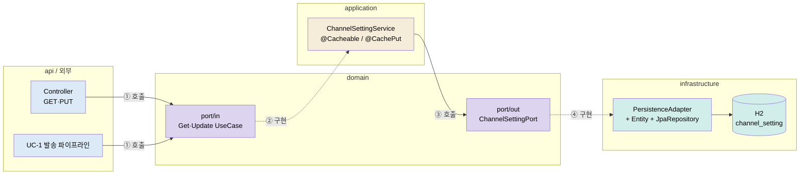

# UC-4 · 알림채널 설정 — REST 계약, 캐시 갱신, 헥사고날 구조

> 사용자가 채널별 수신 여부를 조회·저장하는 REST 계약(FR-12)과, 저장이 발송 파이프라인에 **즉시** 반영되게 만드는 캐시 갱신을 학습 단위로 다룹니다. 2026-07-21 헥사고날 분리(`channel` 컨텍스트) 이후 구조가 기준입니다.

- 근거: 구현 커밋 `ab36f0d`(REST 계약+캐시 갱신), 리팩토링 커밋 `0173527`(헥사고날 분리), 2026-07-21 스모크 E2E
- 연결: [UC-4 리뷰 노트](../uc/UC-4.md) · [UC-1 학습 문서](UC-1-kafka-notification.md)(캐시를 읽는 쪽) · [컨벤션](../../../../AGENTS.md)

## 구현 개요 — 먼저 읽는 지도

구현 범위는 세 가지입니다. ① `GET/PUT /api/users/{userId}/channels/{channelType}` REST 계약, ② 저장 시 `@CachePut`으로 캐시를 새 값으로 덮어쓰는 갱신 경로, ③ 이 전부를 담는 헥사고날 `channel` 컨텍스트(api·application·domain·infrastructure 4계층).

| 구성요소 | 파일 | 역할 |
|---|---|---|
| REST 어댑터 | `channel/api/ChannelSettingController.java` | GET/PUT 계약. in-port만 호출 |
| 요청/응답 DTO | `channel/api/ChannelSettingUpdateRequest·Response.java` | 바디에는 `enabled`만. 나머지는 경로 변수 |
| 유스케이스 구현 | `channel/application/ChannelSettingService.java` | `@Cacheable` 조회 + `@CachePut` 저장. 두 in-port 구현 |
| in-port | `channel/domain/port/in/Get·UpdateChannelSettingUseCase.java` | 컨트롤러와 발송 파이프라인의 진입 인터페이스 |
| 도메인 모델 | `channel/domain/model/ChannelSetting.java` | 순수 POJO. 프레임워크 import 없음 |
| out-port | `channel/domain/port/out/ChannelSettingPort.java` | 도메인이 선언한 영속 인터페이스 |
| JPA 어댑터 | `channel/infrastructure/persistence/ChannelSettingEntity·JpaRepository·PersistenceAdapter.java` | `channel_setting` 테이블 매핑과 out-port 구현, 엔티티↔도메인 변환. 2026-07-22 대상별 하위 패키지로 재배치 |
| 소비자 (UC-1) | `send/application/NotificationSendService.java` | `GetChannelSettingUseCase`를 주입받아 수신거부 필터링 |

검증 상태: REST 계약과 "PUT 수신거부 → 즉시 재발행 차단"은 2026-07-20 수동 검증과 2026-07-21 리팩토링 후 스모크 E2E로 실행 확인했습니다. 캐시 키 일치 요구, 포트 역의존 같은 구조 주장은 아직 코드상 추론입니다(아래 표).

## 증거 등급

**확인됨**: 실행해서 관찰했다 · **코드상 추론**: 코드·설정상 그렇게 동작할 수밖에 없으나 실행으로 보진 않았다 · **미검증**: 코드를 읽어도 확정할 수 없다.

| 주장 | 등급 | 근거 |
|---|---|---|
| GET은 설정이 없으면 기본값 true로 응답한다 | 확인됨 | 2026-07-21 스모크 STEP1 |
| PUT 저장이 발송 경로에 즉시 반영된다 (TTL 대기 없음) | 확인됨 | 스모크 STEP4~7 — PUT 후 재발행 시 WireMock 도달 수 정지, "발송 대상 없음" 로그 |
| 헥사고날 분리 후에도 동작이 보존된다 | 확인됨 | 스모크 전체 PASS (리팩토링 전 검증 시나리오와 동일 결과) |
| `@CachePut` 키가 `@Cacheable` 키와 다르면 갱신이 조용히 실패한다 | 코드상 추론 | 두 어노테이션의 SpEL이 같아서 동작하는 것일 뿐, 불일치 상황은 실행해 보지 않음 |
| 발송 파이프라인은 구체 클래스를 모르고 in-port만 안다 | 코드상 추론 | 컴파일 사실. 위반을 막는 자동 가드(ArchUnit 등)는 없음 |
| enabled 누락 PUT은 400으로 거부된다 | 코드상 추론 | `@NotNull` + `@Valid` 선언. 실제 응답은 확인 안 함 |
| 다중 인스턴스에서는 이 캐시 갱신이 다른 인스턴스에 안 퍼진다 | 미검증 | Caffeine은 인스턴스 로컬. 다중 기동 실험 없음 (구조적 한계로 추정) |

## 후속 검증

| 항목 | 상태 | 확인 방법 |
|---|---|---|
| 캐시 키 불일치 시나리오 | 대기 | 한쪽 SpEL을 일부러 바꿔 기동 → PUT 후 GET이 옛 값을 주는지 관찰 (실험 후 원복) |
| enabled 누락 PUT의 400 응답 | 대기 | `{}` 바디로 PUT → 상태코드·에러 메시지 확인 |
| 계층 의존 규칙의 자동 가드 | 대기 | ArchUnit 룰(예: domain은 spring·jakarta import 금지) 추가 — Phase 2-1 테스트 작업과 병행 검토 |

## Phase 진행 기록

> 각 Phase는 대화로 진행하고, 여기에는 통과 여부와 해결된 오해만 남깁니다. 개인 답변 원문은 기록하지 않습니다.

- [x] Phase 1 · 맥락과 예측 — put/evict 트레이드오프를 데이터 성격(드문 쓰기·미스 비용 청구처)으로 조립. opt-in/opt-out 개념은 보충 설명으로 채움 (2026-07-21)
- [x] Phase 2 · 안내된 흐름 읽기 — 캐시 기록 시점(정상 리턴 후 프록시)은 즉답, 포트 구조는 안내 설명으로 보완 후 통과 (2026-07-21)
- [x] Phase 3 · 실패·경계 추적 — 키 불일치의 조용한 실패와 다중 인스턴스 stale을 등급과 함께 설명 (2026-07-21)
- [ ] Phase 4 · 실측 실습 — 생략. 실험 2건(400 응답·키 불일치)은 후속 검증 표에 대기 유지
- [x] Phase 5 · 능동 인출 — **압축 인출(2문항)로 통과** (2026-07-21). put 선택 근거는 완전 재구성, in-port 구현 주체(application)는 1회 교정

해결된 오해: ① evict/put의 선택 논리가 초기에 뒤바뀌어 있던 것을 "같은 키 동시 쓰기 빈도 + 미스 비용 청구처" 축으로 재정렬 ② in-port·out-port의 선언/구현 주체 혼동 — "domain은 계약서만 쓰고 구현하지 않는다. 들어오는 계약은 application이, 나가는 계약은 infrastructure가 서명한다"로 정리 ③ `@CachePut`을 "지우고 넣는 2단계"로 오해하던 것을 단일 put 연산 + DB 커밋 순서와의 역전 위험으로 교정.
