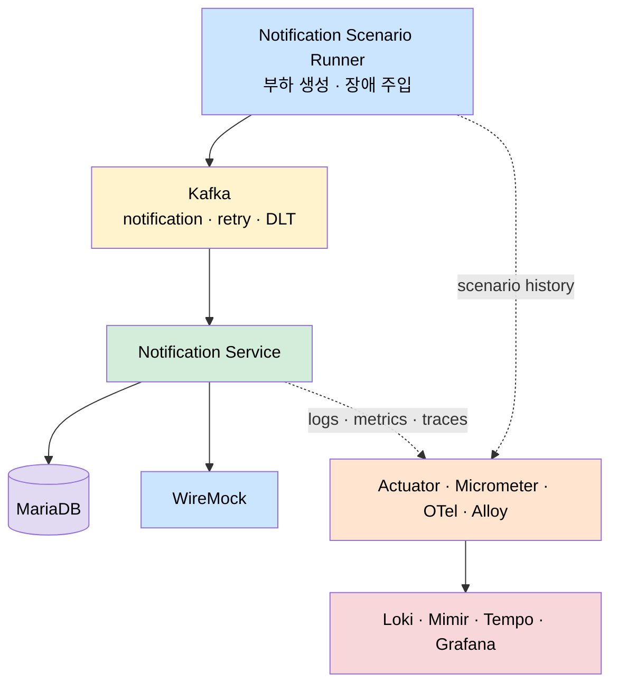
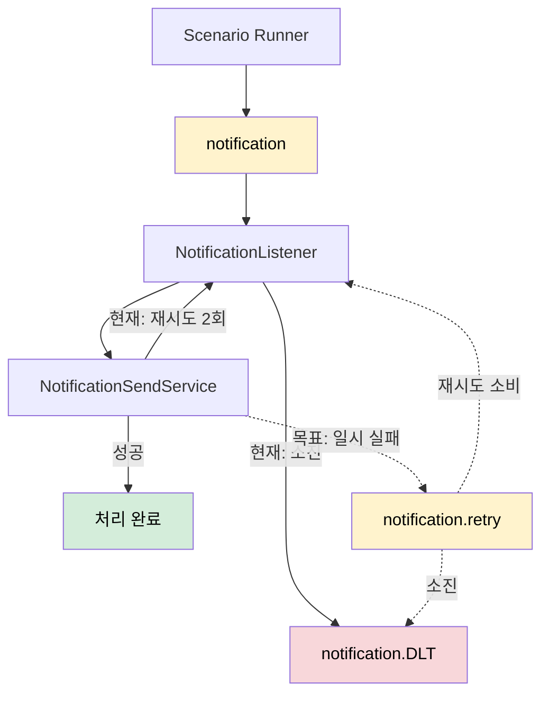
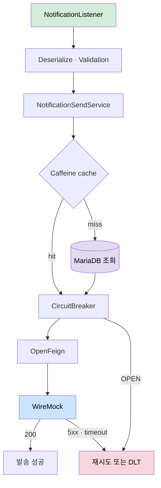
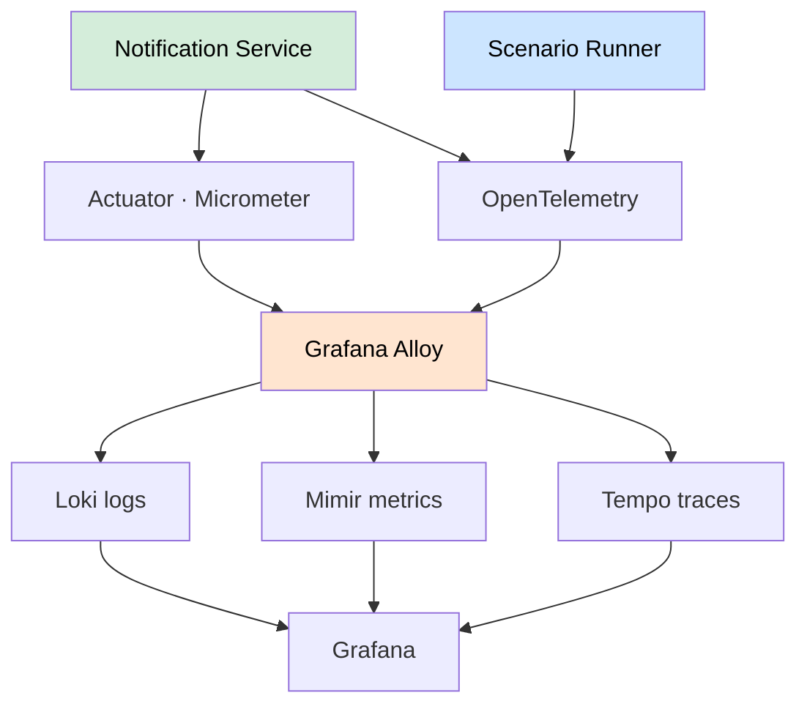
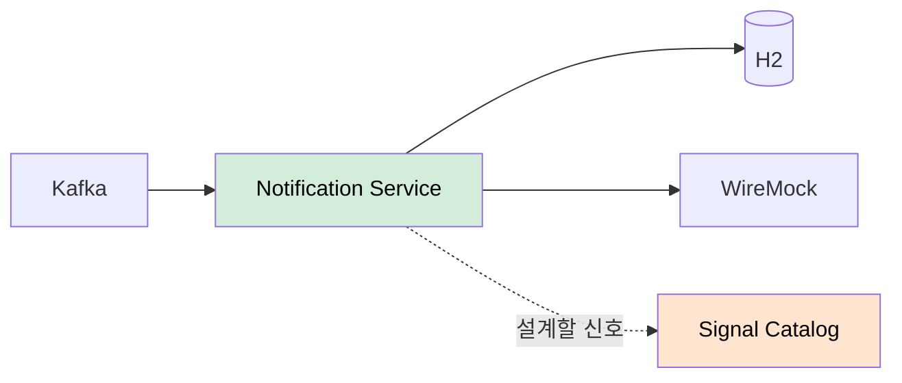
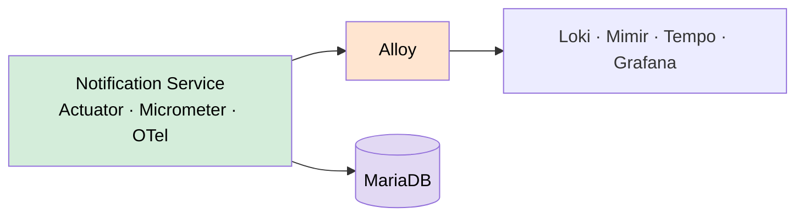
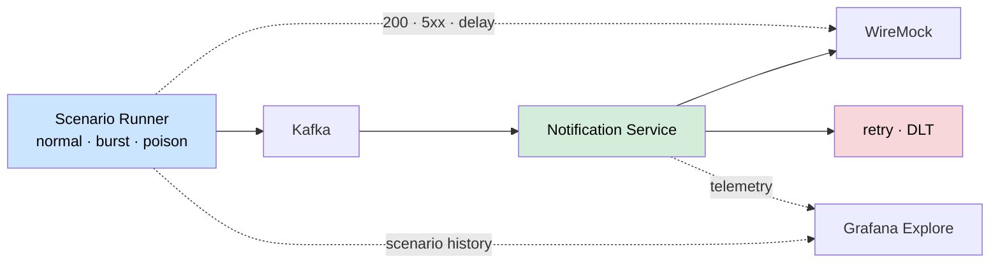
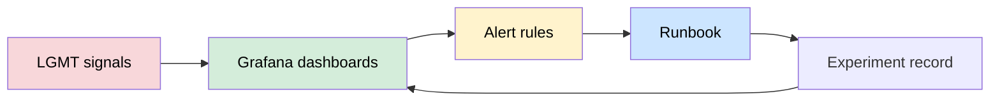

# LGMT Observability 아키텍처

`notification-service`는 관측 대상이고, `notification-scenario-runner`는 장애를 재현하는 발생기입니다. LGMT는 증거를 저장하고, Grafana는 그 증거를 탐색하는 관제 화면입니다.

## 전체 미들웨어 배치

## Kafka 처리·재시도·DLT

현재 구현은 인메모리 2회 재시도 뒤 DLT로 보냅니다. `notification.retry`는 Phase 3에서 추가할 목표 상태이며 점선으로 표시합니다.

## Notification Service 내부 흐름

## LGMT 관측 파이프라인

## 주차별 발전 아키텍처

### 1주차 — 관측 설계와 정상 기준선

### 2주차 — 계측과 LGMT 연결

### 3주차 — 장애 주입과 증거 수집

### 4주차 — 운영 결과물화

