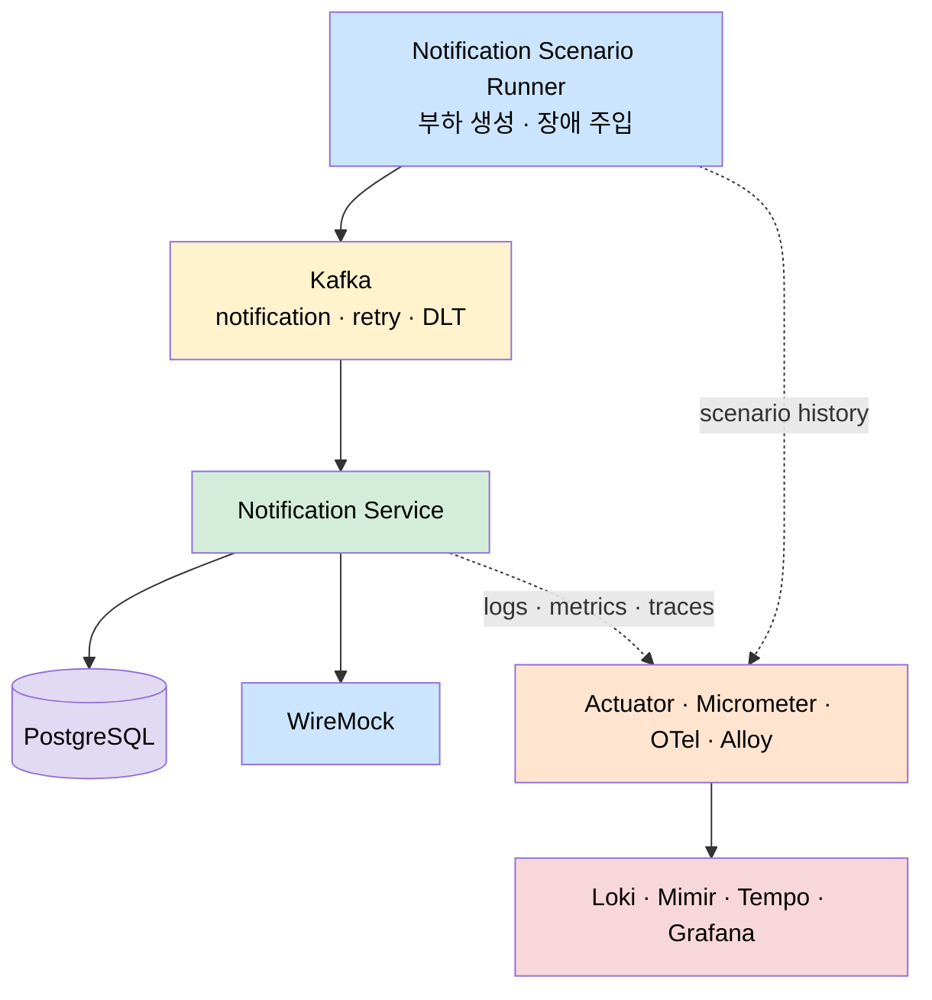
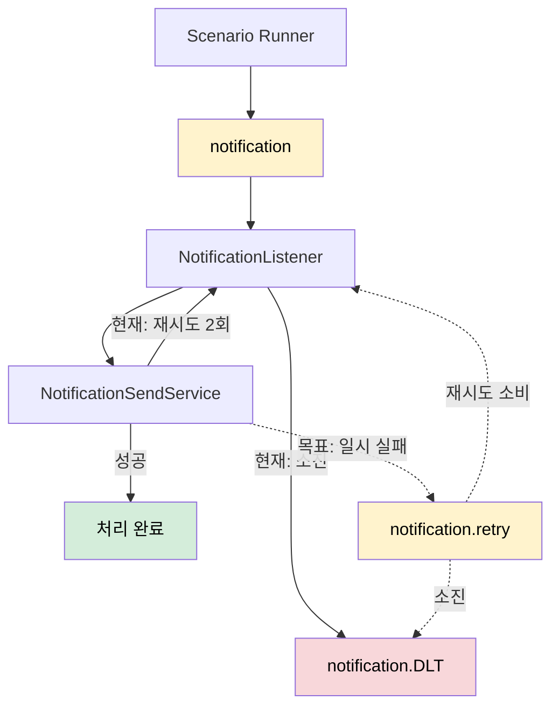
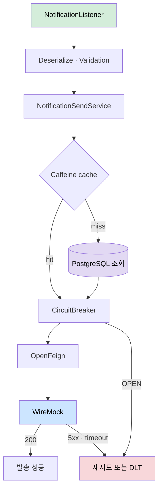
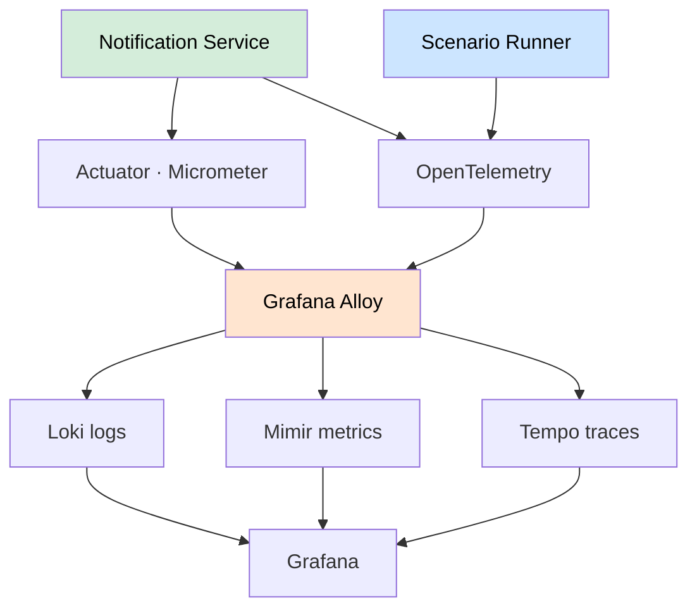
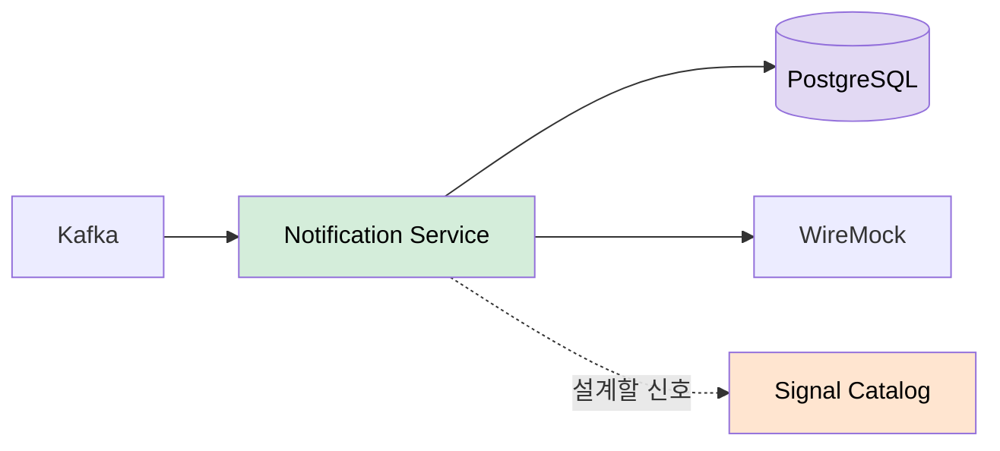
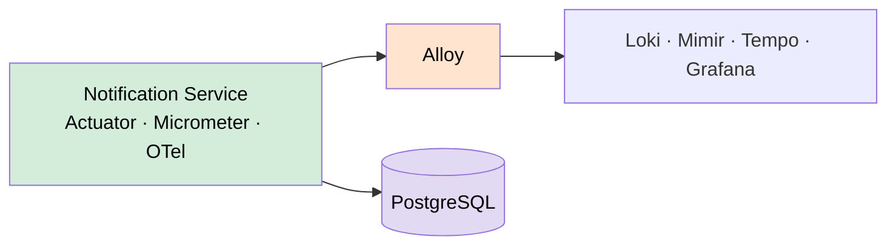
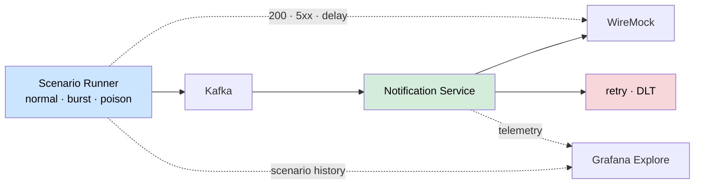
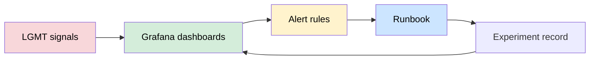

# LGMT Observability 아키텍처

`notification-service`는 관측 대상이고, `notification-scenario-runner`는 장애를 재현하는 발생기입니다. LGMT는 증거를 저장하고, Grafana는 그 증거를 탐색하는 관제 화면입니다. 채널 설정과 발송 이력은 PostgreSQL에 저장하며, cache miss가 DB·HikariCP 신호로 이어지는 흐름을 관측합니다.

## 전체 미들웨어 배치

## Kafka 처리·재시도·DLT

현재 구현은 인메모리 2회 재시도 뒤 DLT로 보냅니다. `notification.retry`는 3단계에서 추가할 목표 상태이며 점선으로 표시합니다.

## Notification Service 내부 흐름

캐시 미스는 PostgreSQL 조회로 이어지고, 그 조회는 HikariCP 커넥션 풀을 거칩니다. 그래서 cache hit ratio가 떨어지면 DB query latency와 풀의 active·pending 커넥션이 함께 관측 대상이 됩니다 — 이 연쇄가 3단계 DB 병목 실험(UC-07)의 핵심입니다.

## LGMT 관측 파이프라인

## 주차별 발전 아키텍처

각 주차는 앞 주차 위에 한 겹을 더 얹습니다. 다이어그램 아래에 그 주차가 무엇을 세우는지와, 그 위에서 주로 관측되는 신호·키워드를 함께 둡니다.

### 1주차 — 관측 설계와 정상 기준선

아직 LGMT를 붙이지 않고, 무엇을 관측할지부터 정합니다. 정상 트래픽을 흘려 기준선(baseline)을 잡고, 어떤 신호를 어떤 이름으로 볼지 Signal Catalog에 적습니다. 기준선이 없으면 나중에 "이 값이 이상한가"를 판단할 잣대가 없으므로, 이 주차의 산출물이 이후 모든 실험의 비교 기준이 됩니다.

| 관측 신호 | 조회 키워드 | 산출물 |
|-----------|------------|--------|
| 처리량·지연·소비 지연의 정상 범위 | `records-consumed-rate`, `p95 latency`, `consumer lag` | Signal Catalog, 기준선 기록 |
| 캐시·DB의 정상 동작 | `cache hit ratio`, `HikariCP active` | failure scenario 목록 |

### 2주차 — 계측과 LGMT 연결

서비스에 Actuator·Micrometer·OpenTelemetry를 붙이고, Alloy가 그 신호를 Loki·Mimir·Tempo로 실어 나릅니다. 이 주차의 핵심은 **하나의 요청을 로그·메트릭·트레이스에서 같은 `traceId`로 잇는 것**입니다. traceId가 연결되면 "메트릭에서 느린 구간을 보고 → 그 트레이스로 이동 → 그 로그를 읽는" 조사 동선이 열립니다.

| 관측 신호 | 조회 키워드 | 산출물 |
|-----------|------------|--------|
| 로그-트레이스 상관 | `traceId`, `spanId`, Tempo `service.name` | 정상 dashboard |
| 메트릭 수집 확인 | `http_server_requests`, `jvm_memory_used`, `pg` datasource | Alloy 파이프라인 |

### 3주차 — 장애 주입과 증거 수집

Scenario Runner가 정상·burst·poison 트래픽과 WireMock 장애 모드를 주입하고, 그 순간의 증거를 Grafana Explore에서 수집합니다. 같은 증상(DLT 증가·consumer lag)이라도 원인이 외부 API·역직렬화·DB·JVM 중 무엇인지는 신호 조합으로만 갈립니다 — 그래서 이 주차는 재현 조건과 증거를 짝지어 실험 기록으로 남깁니다.

| 관측 신호 | 조회 키워드 | 산출물 |
|-----------|------------|--------|
| 외부 장애 전파 | `feign latency`, `CircuitBreaker state`, `not permitted`, `DLT` | 관측 UC(01~12) 실험 기록 |
| 소비·DB 병목 | `consumer lag`, `pg query latency`, `HikariCP pending` | 재현법·증거·원인 판단 |
| 메시지 오류 | `deserialization error`, `failureReason`, `topic/partition/offset` | scenario history 대조 |

### 4주차 — 운영 결과물화

흩어진 신호를 재사용 가능한 운영 자산으로 굳힙니다. 대시보드는 증상을 한눈에 보여주고, alert는 임계 초과를 알리며, Runbook은 "이 증상이면 이 순서로 조사하라"를 담습니다. 실험 기록이 다시 대시보드 설계로 피드백되는 순환이 이 주차의 목표입니다.

| 관측 신호 | 조회 키워드 | 산출물 |
|-----------|------------|--------|
| 임계 초과 감지 | `consumer lag > N`, `DLT rate`, `CircuitBreaker OPEN` | dashboard JSON, alert rule |
| 조사 절차 표준화 | metric → log → trace 순서 | Runbook, final review |
